## MỤC LỤC CHI TIẾT

- [CHƯƠNG 1: CÁC KHÁI NIỆM CƠ BẢN VÀ NỀN TẢNG TOÁN HỌC CỦA MẠNG NƠ-RON HỒI QUY](#chương-1-các-khái-niệm-cơ-bản-và-nền-tảng-toán-học-của-mạng-nơ-ron-hồi-quy)
    - [1.1. Bản chất dữ liệu tuần tự và giới hạn của mạng nơ-ron truyền thẳng](#11-bản-chất-dữ-liệu-tuần-tự-và-giới-hạn-của-mạng-nơ-ron-truyền-thẳng)
    - [1.2. Cơ chế hồi quy, bộ nhớ nội tại và trạng thái ẩn](#12-cơ-chế-hồi-quy-bộ-nhớ-nội-tại-và-trạng-thái-ẩn)
    - [1.3. Nguyên lý chia sẻ tham số qua không gian và thời gian](#13-nguyên-lý-chia-sẻ-tham-số-qua-không-gian-và-thời-gian)
    - [1.4. Biểu diễn hàm toán học và sơ đồ cuộn mở đồ thị tính toán](#14-biểu-diễn-hàm-toán-học-và-sơ-đồ-cuộn-mở-đồ-thị-tính-toán)
    - [1.5. Giải thuật lan truyền ngược qua thời gian (BPTT)](#15-giải-thuật-lan-truyền-ngược-qua-thời-gian-bptt)
    - [1.6. Hiện tượng triệt tiêu và bùng nổ đạo hàm](#16-hiện-tượng-triệt-tiêu-và-bùng-nổ-đạo-hàm)
    - [1.7. Các kiến trúc tiến hóa: Mạng LSTM và Mạng GRU](#17-các-kiến-trúc-tiến-hóa-mạng-lstm-và-mạng-gru)
    - [1.8. Cài đặt mô hình hồi quy thuần túy từ đầu bằng NumPy](#18-cài-đặt-mô-hình-hồi-quy-thuần-túy-từ-đầu-bằng-numpy)
- [CHƯƠNG 2: ĐẶC TẢ HAI TẬP DỮ LIỆU THỰC NGHIỆM VÀ PHÂN TÍCH PHÂN BỐ THỐNG KÊ](#chương-2-đặc-tả-hai-tập-dữ-liệu-thực-nghiệm-và-phân-tích-phân-bố-thống-kê)
    - [2.1. Tập dữ liệu 1: Chuỗi thời gian thị trường chứng khoán](#21-tập-dữ-liệu-1-chuỗi-thời-gian-thị-trường-chứng-khoán)
    - [2.2. Phân tích phân phối lợi suất, tính bất đối xứng và độ biến động cổ phiếu](#22-phân-tích-phân-phối-lợi-suất-tính-bất-đối-xứng-và-độ-biến-động-cổ-phiếu)
    - [2.3. Tập dữ liệu 2: Chuỗi thời gian giá vàng thế giới qua các chu kỳ kinh tế](#23-tập-dữ-liệu-2-chuỗi-thời-gian-giá-vàng-thế-giới-qua-các-chu-kỳ-kinh-tế)
    - [2.4. Phân tích xu thế dài hạn, đường trung bình động và độ biến động giá vàng](#24-phân-tích-xu-thế-dài-hạn-đường-trung-bình-động-và-độ-biến-động-giá-vàng)
    - [2.5. Phân tích hàm tự tương quan (ACF) và độ trễ thời gian](#25-phân-tích-hàm-tự-tương-quan-acf-và-độ-trễ-thời-gian)
    - [2.6. Quy trình phân tách chuỗi thời gian và trích xuất cửa sổ trượt chống rò rỉ thông tin](#26-quy-trình-phân-tách-chuỗi-thời-gian-và-trích-xuất-cửa-sổ-trượt-chống-rò-rỉ-thông-tin)
- [CHƯƠNG 3: XÂY DỰNG MÔ HÌNH VỚI PYTORCH ĐỂ DỰ ĐOÁN](#chương-3-xây-dựng-mô-hình-với-pytorch-để-dự-đoán)
    - [3.1. Triết lý thiết kế module hướng đối tượng trong PyTorch](#31-triết-lý-thiết-kế-module-hướng-đối-tượng-trong-pytorch)
    - [3.2. Cấu trúc đóng gói dữ liệu với Dataset và DataLoader chuỗi thời gian](#32-cấu-trúc-đóng-gói-dữ-liệu-với-dataset-và-dataloader-chuỗi-thời-gian)
    - [3.3. Xây dựng kiến trúc mô hình hồi quy đa lớp linh hoạt](#33-xây-dựng-kiến-trúc-mô-hình-hồi-quy-đa-lớp-linh-hoạt)
    - [3.4. Vòng lặp huấn luyện tường minh, kiểm soát Gradient Clipping và tối ưu AdamW](#34-vòng-lặp-huấn-luyện-tường-minh-kiểm-soát-gradient-clipping-và-tối-ưu-adamw)
    - [3.5. Đánh giá chất lượng dự đoán trên tập kiểm thử độc lập](#35-đánh-giá-chất-lượng-dự-đoán-trên-tập-kiểm-thử-độc-lập)
- [CHƯƠNG 4: XÂY DỰNG MÔ HÌNH VỚI TENSORFLOW VÀ KERAS ĐỂ DỰ ĐOÁN](#chương-4-xây-dựng-mô-hình-với-tensorflow-và-keras-để-dự-đoán)
    - [4.1. Kiến trúc mô hình tuần tự với Keras Sequential API](#41-kiến-trúc-mô-hình-tuần-tự-với-keras-sequential-api)
    - [4.2. Cấu hình hệ thống Callbacks giám sát huấn luyện tự động](#42-cấu-hình-hệ-thống-callbacks-giám-sát-huấn-luyện-tự-động)
    - [4.3. Mã nguồn xây dựng và huấn luyện mô hình Keras](#43-mã-nguồn-xây-dựng-và-huấn-luyện-mô-hình-keras)
    - [4.4. Phân tích tham số mạng và cơ chế tính toán nội tại của tầng hồi quy](#44-phân-tích-tham-số-mạng-và-cơ-chế-tính-toán-nội-tại-của-tầng-hồi-quy)
- [CHƯƠNG 5: TRIỂN KHAI MÔ HÌNH PHỤC VỤ SUY LUẬN THỜI GIAN THỰC (DEPLOYMENT)](#chương-5-triển-khai-mô-hình-phục-vụ-suy-luận-thời-gian-thực-deployment)
    - [5.1. Kiến trúc tổng thể hệ thống suy luận dự báo trong môi trường sản xuất](#51-kiến-trúc-tổng-thể-hệ-thống-suy-luận-dự-báo-trong-môi-trường-sản-xuất)
    - [5.2. Đóng gói Engine suy luận và chuẩn hóa độc lập](#52-đóng-gói-engine-suy-luận-và-chuẩn-hóa-độc-lập)
    - [5.3. Triển khai REST API với FastAPI cho mô hình PyTorch](#53-triển-khai-rest-api-với-fastapi-cho-mô-hình-pytorch)
    - [5.4. Triển khai REST API với FastAPI cho mô hình Keras](#54-triển-khai-rest-api-với-fastapi-cho-mô-hình-keras)
    - [5.5. Cơ chế dự báo tự hồi quy đa bước tương lai (Autoregressive Rollout)](#55-cơ-chế-dự-báo-tự-hồi-quy-đa-bước-tương-lai-autoregressive-rollout)
- [CHƯƠNG 6: TỔNG HỢP ĐỐI CHUẨN THỰC NGHIỆM VÀ PHÂN TÍCH CHUYÊN SÂU](#chương-6-tổng-hợp-đối-chuẩn-thực-nghiệm-và-phân-tích-chuyên-sâu)
    - [6.1. Bảng đối chuẩn hiệu năng toàn diện trên hai tập dữ liệu](#61-bảng-đối-chuẩn-hiệu-năng-toàn-diện-trên-hai-tập-dữ-liệu)
    - [6.2. Động học hội tụ và độ ổn định của các đường cong học tập](#62-động-học-hội-tụ-và-độ-ổn-định-của-các-đường-cong-học-tập)
    - [6.3. Khảo sát quỹ đạo dự đoán và sai số phân phối ngoại suy](#63-khảo-sát-quỹ-đạo-dự-đoán-và-sai-số-phân-phối-ngoại-suy)
    - [6.4. Đánh giá sự đánh đổi giữa độ chính xác và độ trễ tính toán phục vụ sản xuất](#64-đánh-giá-sự-đánh-đổi-giữa-độ-chính-xác-và-độ-trễ-tính-toán-phục-vụ-sản-xuất)
- [CHƯƠNG 7: KẾT LUẬN VÀ BÀI HỌC THIẾT KẾ HỆ THỐNG](#chương-7-kết-luận-và-bài-học-thiết-kế-hệ-thống)
    - [7.1. Đánh đổi giữa quyền kiểm soát toán học và tốc độ phát triển công nghiệp](#71-đánh-đổi-giữa-quyền-kiểm-soát-toán-học-và-tốc-độ-phát-triển-công-nghiệp)
    - [7.2. Lựa chọn kiến trúc mạng: Vanilla RNN, GRU hay LSTM trong bối cảnh thực tế](#72-lựa-chọn-kiến-trúc-mạng-vanilla-rnn-gru-hay-lstm-trong-bối-cảnh-thực-tế)
    - [7.3. Khuyến nghị thiết kế pipeline dự báo dữ liệu tài chính và kim loại quý](#73-khuyến-nghị-thiết-kế-pipeline-dự-báo-dữ-liệu-tài-chính-và-kim-loại-quý)
    - [7.4. Quy trình đóng gói và triển khai mô hình phục vụ suy luận thời gian thực](#74-quy-trình-đóng-gói-và-triển-khai-mô-hình-phục-vụ-suy-luận-thời-gian-thực)

Kho lưu trữ mã nguồn và triển khai hệ thống: [https://github.com/LeeMinhPhuowng/Assignment-06](https://github.com/LeeMinhPhuowng/Assignment-06)

# CHƯƠNG 1: CÁC KHÁI NIỆM CƠ BẢN VÀ NỀN TẢNG TOÁN HỌC CỦA MẠNG NƠ-RON HỒI QUY

### 1.1. Bản chất dữ liệu tuần tự và giới hạn của mạng nơ-ron truyền thẳng
Trong lý thuyết học máy truyền thống, các thuật toán phân lớp và hồi quy thường giả định rằng các mẫu dữ liệu quan sát được lấy mẫu độc lập và có cùng phân phối (Independent and Identically Distributed - i.i.d.):

$$P(x_1, x_2, \dots, x_N) = \prod_{i=1}^N P(x_i)$$

Tuy nhiên, trong các bài toán thực tiễn như chuỗi giá chứng khoán, giá kim loại quý, tín hiệu cảm biến IoT hay chuỗi từ ngữ trong ngôn ngữ tự nhiên, giả định i.i.d. hoàn toàn bị vi phạm. Một điểm dữ liệu $x_t$ tại bước thời gian $t$ luôn mang mối tương quan mật thiết với các điểm dữ liệu xuất hiện trước nó $(x_{t-1}, x_{t-2}, \dots, x_1)$. 

Các mạng nơ-ron truyền thẳng truyền thống (Multi-Layer Perceptrons - MLP) tiếp nhận một vector đầu vào có chiều cố định $x \in \mathbb{R}^D$ và ánh xạ trực tiếp sang vector đầu ra $\hat{y} \in \mathbb{R}^K$ thông qua phép nhân ma trận kết hợp kích hoạt phi tuyến:

$$\hat{y} = f(W_L \cdot \sigma(W_{L-1} \dots \sigma(W_1 x + b_1) \dots + b_{L-1}) + b_L)$$

Mô hình hóa này gặp phải ba rào cản nền tảng khi đối mặt với dữ liệu chuỗi:

- Chiều dài chuỗi biến thiên: MLP yêu cầu kích thước vector đầu vào phải cố định trước, không thể tiếp nhận các chuỗi thời gian có độ dài thay đổi linh hoạt.
- Thiếu cơ chế chia sẻ thông tin vị trí: Khi duỗi phẳng một chuỗi thời gian thành một vector dài, các trọng số nối với vị trí $t_1$ hoàn toàn độc lập với các trọng số nối với vị trí $t_2$, khiến mạng không thể khái quát hóa các mô thức (patterns) có tính chất bất biến tịnh tiến theo thời gian.
- Bùng nổ tham số: Khi chuỗi có độ dài lớn $T$, số lượng tham số của ma trận trọng số tầng đầu vào $W_1 \in \mathbb{R}^{H \times (T \cdot D)}$ tăng tuyến tính theo chiều dài chuỗi, dẫn đến nguy cơ quá khớp cực kỳ nghiêm trọng.

### 1.2. Cơ chế hồi quy, bộ nhớ nội tại và trạng thái ẩn
Để vượt qua giới hạn của mạng truyền thẳng, mạng nơ-ron hồi quy (Recurrent Neural Network - RNN) đưa vào cấu trúc một vòng lặp phản hồi (recurrent loop). Tại mỗi bước thời gian $t$, mạng duy trì một vector trạng thái ẩn (hidden state) $h_t \in \mathbb{R}^H$. Trạng thái ẩn đóng vai trò như một bộ nhớ nội tại (internal memory), tổng hợp và chưng cất toàn bộ thông tin lịch sử từ các bước thời gian quá khứ $x_1, x_2, \dots, x_t$.

Cơ chế cập nhật trạng thái ẩn được biểu diễn như một hàm chuyển tiếp trạng thái:

$$h_t = f_{recurrent}(h_{t-1}, x_t; \theta)$$

Trong đó $h_{t-1}$ là thông tin tóm tắt quá khứ đến thời điểm $t-1$, $x_t$ là vector quan sát mới tại thời điểm $t$, và $\theta$ là tập tham số có thể học được của mạng. Nhờ cơ chế chuyển trạng thái đệ quy này, trạng thái ẩn $h_t$ về mặt lý thuyết chứa đựng thông tin của một chuỗi lịch sử có độ dài tùy ý mà không làm thay đổi kích thước của vector biểu diễn.

### 1.3. Nguyên lý chia sẻ tham số qua không gian và thời gian
Trụ cột cốt lõi làm nên sức mạnh và khả năng khái quát hóa của mạng hồi quy chính là nguyên lý chia sẻ tham số (parameter sharing across time). Thay vì gán một ma trận trọng số riêng biệt cho từng bước thời gian, RNN sử dụng chung một bộ trọng số duy nhất $\theta = \{W_{xh}, W_{hh}, W_{hy}, b_h, b_y\}$ cho toàn bộ các bước thời gian $t = 1, 2, \dots, T$.

Ý nghĩa toán học và tính toán của việc chia sẻ tham số:

- Giảm số lượng tham số độc lập: Số lượng tham số của mạng trở nên độc lập tuyệt đối với chiều dài chuỗi $T$, loại bỏ hoàn toàn hiện tượng bùng nổ tham số khi xử lý các chuỗi thời gian dài.
- Học biểu diễn bất biến thời gian: Mạng có khả năng nhận diện một mô thức đặc trưng (chẳng hạn một mô hình đảo chiều giá trên thị trường tài chính) bất kể mô thức đó xuất hiện tại đầu chuỗi, giữa chuỗi hay cuối chuỗi.
- Khả năng suy luận trên chuỗi có độ dài chưa từng thấy: Mô hình được huấn luyện trên chuỗi có độ dài $T_{train}$ hoàn toàn có thể thực thi suy luận trên chuỗi có độ dài $T_{test} \neq T_{train}$.

### 1.4. Biểu diễn hàm toán học và sơ đồ cuộn mở đồ thị tính toán
Về mặt giải tích, mạng Vanilla RNN thực thi phép toán tổng hợp thông tin qua hai phương trình cơ bản tại mỗi bước thời gian $t$:

$$a_t = W_{hh} h_{t-1} + W_{xh} x_t + b_h$$

$$h_t = \tanh(a_t) = \frac{e^{a_t} - e^{-a_t}}{e^{a_t} + e^{-a_t}}$$

Trong đó:

- $x_t \in \mathbb{R}^{D \times 1}$ là vector đặc trưng đầu vào tại bước $t$.
- $h_{t-1} \in \mathbb{R}^{H \times 1}$ là vector trạng thái ẩn của bước trước đó.
- $W_{xh} \in \mathbb{R}^{H \times D}$ là ma trận trọng số kết nối đầu vào với trạng thái ẩn.
- $W_{hh} \in \mathbb{R}^{H \times H}$ là ma trận trọng số chuyển tiếp giữa các trạng thái ẩn liên tiếp.
- $b_h \in \mathbb{R}^{H \times 1}$ là vector điều chỉnh độ lệch (bias).
- $\tanh(\cdot)$ là hàm kích hoạt phi tuyến ánh xạ toàn bộ miền giá trị thực về khoảng $(-1, 1)$.

Vector đầu ra dự đoán tại bước $t$ (hoặc tại bước cuối cùng $T$) được tính toán bằng cách chiếu trạng thái ẩn sang không gian đích:

$$\hat{y}_t = g(W_{hy} h_t + b_y)$$

Trong bài toán hồi quy chuỗi thời gian đơn biến hoặc đa biến, hàm $g(\cdot)$ là hàm đồng nhất tuyến tính $g(z) = z$, khi đó:

$$\hat{y}_t = W_{hy} h_t + b_y$$

Trong đó $W_{hy} \in \mathbb{R}^{K \times H}$ và $b_y \in \mathbb{R}^{K \times 1}$.

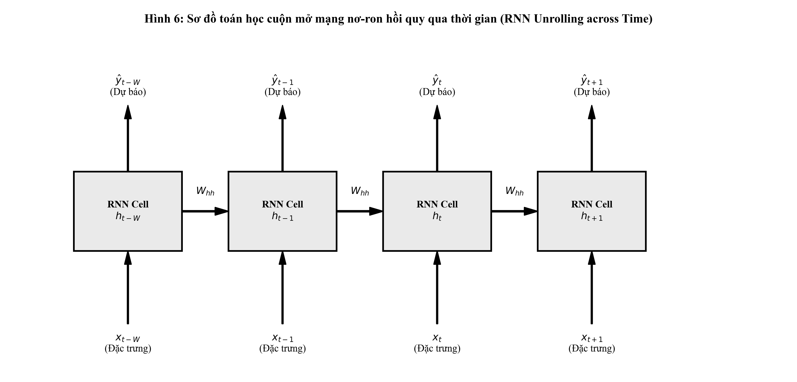

Biểu đồ Hình 6 minh họa trực quan quá trình cuộn mở (unrolling/unfolding) của đồ thị tính toán hồi quy theo dòng thời gian. Mặc dù cấu trúc mạng có thể được biểu diễn cô đọng như một ô nơ-ron tự phản hồi, việc cuộn mở đồ thị tính toán giúp chuyển đổi đồ thị chu trình thành một đồ thị có hướng không chu trình (Directed Acyclic Graph - DAG) với chiều dài $T$, mở đường cho việc áp dụng quy tắc dây chuyền để tính đạo hàm lan truyền ngược.

### 1.5. Giải thuật lan truyền ngược qua thời gian (BPTT)
Để tối ưu hóa các ma trận trọng số $W_{xh}, W_{hh}, W_{hy}$ và các vector bias $b_h, b_y$, giải thuật lan truyền ngược qua thời gian (Backpropagation Through Time - BPTT) được áp dụng. Giả sử hàm mất mát tổng thể trên toàn bộ chuỗi thời gian có độ dài $T$ được định nghĩa bằng tổng các mất mát cục bộ:

$$\mathcal{L} = \sum_{t=1}^T \mathcal{L}_t(y_t, \hat{y}_t)$$

Xét trường hợp hàm mất mát sai số bình phương trung bình (MSE):

$$\mathcal{L}_t = \frac{1}{2} \| y_t - \hat{y}_t \|_2^2$$

Đạo hàm của hàm mất mát đối với ma trận trọng số đầu ra $W_{hy}$ phụ thuộc trực tiếp vào trạng thái ẩn tại từng bước thời gian:

$$\frac{\partial \mathcal{L}}{\partial W_{hy}} = \sum_{t=1}^T \frac{\partial \mathcal{L}_t}{\partial \hat{y}_t} \cdot \frac{\partial \hat{y}_t}{\partial W_{hy}} = \sum_{t=1}^T (\hat{y}_t - y_t) h_t^T$$

Ngược lại, việc tính toán đạo hàm theo ma trận hồi quy $W_{hh}$ phức tạp hơn nhiều vì trạng thái ẩn $h_t$ không chỉ phụ thuộc vào $W_{hh}$ ở bước $t$, mà còn phụ thuộc thông qua trạng thái $h_{t-1}$, vốn lại phụ thuộc vào $h_{t-2}$, kéo dài ngược về $h_0$. Áp dụng quy tắc dây chuyền nhiều biến:

$$\frac{\partial \mathcal{L}}{\partial W_{hh}} = \sum_{t=1}^T \sum_{k=1}^t \frac{\partial \mathcal{L}_t}{\partial h_t} \cdot \frac{\partial h_t}{\partial h_k} \cdot \frac{\partial^+ h_k}{\partial W_{hh}}$$

Trong đó $\frac{\partial^+ h_k}{\partial W_{hh}}$ biểu diễn đạo hàm cục bộ của $h_k$ theo $W_{hh}$ (coi $h_{k-1}$ là hằng số):

$$\frac{\partial^+ h_k}{\partial W_{hh}} = \text{diag}(1 - h_k^2) h_{k-1}^T$$

Thành phần then chốt quyết định dòng chảy đạo hàm qua thời gian là đạo hàm riêng ma trận Jacobi $\frac{\partial h_t}{\partial h_k}$:

$$\frac{\partial h_t}{\partial h_k} = \prod_{j=k+1}^t \frac{\partial h_j}{\partial h_{j-1}} = \prod_{j=k+1}^t W_{hh}^T \cdot \text{diag}(1 - h_j^2)$$

### 1.6. Hiện tượng triệt tiêu và bùng nổ đạo hàm
Phương trình tích chuỗi ma trận Jacobi ở trên là nguồn gốc toán học trực tiếp của hai vấn đề nan giải bậc nhất trong huấn luyện mạng hồi quy:

1. Triệt tiêu đạo hàm (Vanishing Gradient):
Hàm kích hoạt $\tanh(z)$ có đạo hàm nằm trong khoảng $0 < \tanh'(z) \le 1$. Khi mạng học được các trọng số có phổ trị riêng (eigenvalue spectrum) của ma trận $W_{hh}$ nhỏ hơn 1 (tức bán kính phổ $\rho(W_{hh}) < 1$), tích liên tiếp của các ma trận:

$$\left\| \prod_{j=k+1}^t \frac{\partial h_j}{\partial h_{j-1}} \right\| \le \prod_{j=k+1}^t \| W_{hh}^T \| \cdot \| \text{diag}(1 - h_j^2) \| \le (\gamma \cdot \lambda_{max})^{t-k}$$

Khi khoảng cách thời gian $(t - k)$ tăng lên, đại lượng này suy giảm theo hàm mũ về 0. Hệ quả là thông tin sai số tại thời điểm $t$ không thể truyền ngược về các bước thời gian xa trong quá khứ $k \ll t$. Mạng mất hoàn toàn khả năng ghi nhớ và học các mối phụ thuộc dài hạn (long-term dependencies).

2. Bùng nổ đạo hàm (Exploding Gradient):
Nếu bán kính phổ $\rho(W_{hh}) > 1$ và các trạng thái nơ-ron hoạt động trong vùng tuyến tính của hàm tanh ($\tanh'(z) \approx 1$), tích ma trận Jacobi tăng theo cấp số nhân theo chiều dài chuỗi:

$$\left\| \frac{\partial h_t}{\partial h_k} \right\| \to \infty \quad \text{khi } (t - k) \to \infty$$

Hiện tượng này khiến giá trị gradient trong quá trình cập nhật vượt ra ngoài phạm vi biểu diễn dấu phẩy động (gây ra lỗi NaN hoặc Inf), làm rung lắc dữ dội quỹ đạo tối ưu hóa trọng số. 

Giải pháp kiểm soát:

- Kỹ thuật cắt tỉa đạo hàm (Gradient Clipping): Cắt tỉa độ dài chuẩn L2 của vector gradient nếu nó vượt quá ngưỡng $\tau$:

$$g \leftarrow g \cdot \frac{\tau}{\max(\tau, \|g\|_2)}$$

- Khởi tạo trực giao (Orthogonal Initialization): Khởi tạo $W_{hh}$ sao cho $W_{hh}^T W_{hh} = I$, duy trì trị riêng của ma trận xấp xỉ 1 ở giai đoạn đầu huấn luyện.
- Thay đổi kiến trúc tế bào: Sử dụng các cơ chế kiểm soát cổng (gating mechanism) như trong mạng LSTM và GRU.

### 1.7. Các kiến trúc tiến hóa: Mạng LSTM và Mạng GRU

#### 1. Long Short-Term Memory (LSTM)
Được đề xuất bởi Hochreiter và Schmidhuber (1997), LSTM giải quyết triệt để bài toán triệt tiêu đạo hàm bằng cách thiết kế một kênh truyền dẫn thông tin riêng biệt gọi là trạng thái ô nhớ (Cell State) $c_t$, đóng vai trò như một tuyến đường cao tốc thông tin chạy dọc theo toàn bộ chuỗi thời gian với sự can thiệp tối thiểu của các phép nhân ma trận liên tiếp.

Dòng thông tin trong ô LSTM được điều tiết bởi ba cổng nơ-ron có hàm kích hoạt sigmoid $\sigma(z) \in (0, 1)$:

$$\text{Cổng quên (Forget Gate):} \quad f_t = \sigma(W_f [h_{t-1}, x_t] + b_f)$$

$$\text{Cổng vào (Input Gate):} \quad i_t = \sigma(W_i [h_{t-1}, x_t] + b_i)$$

$$\text{Ứng viên trạng thái ô nhớ:} \quad \tilde{c}_t = \tanh(W_c [h_{t-1}, x_t] + b_c)$$

$$\text{Cập nhật trạng thái ô nhớ:} \quad c_t = f_t \odot c_{t-1} + i_t \odot \tilde{c}_t$$

$$\text{Cổng ra (Output Gate):} \quad o_t = \sigma(W_o [h_{t-1}, x_t] + b_o)$$

$$\text{Trạng thái ẩn đầu ra:} \quad h_t = o_t \odot \tanh(c_t)$$

Trong đó ký hiệu $\odot$ đại diện cho phép nhân Hadamard (nhân từng phần tử tương ứng giữa hai tensor). Phép cập nhật $c_t = f_t \odot c_{t-1} + i_t \odot \tilde{c}_t$ là phép cộng trực tiếp. Khi cổng quên $f_t \approx 1$, gradient có thể chảy ngược nguyên vẹn qua ô nhớ $\frac{\partial c_t}{\partial c_{t-1}} \approx 1$ mà không bị suy giảm theo hàm mũ, giải quyết triệt để hiện tượng triệt tiêu đạo hàm trên các chuỗi hàng trăm bước thời gian.

#### 2. Gated Recurrent Unit (GRU)
Được đề xuất bởi Cho et al. (2014), GRU là một biến thể tinh giản của LSTM, hợp nhất trạng thái ô nhớ $c_t$ và trạng thái ẩn $h_t$ thành một vector trạng thái duy nhất, đồng thời thu gọn hệ thống điều khiển xuống còn hai cổng:

$$\text{Cổng đặt lại (Reset Gate):} \quad r_t = \sigma(W_r [h_{t-1}, x_t] + b_r)$$

$$\text{Cổng cập nhật (Update Gate):} \quad z_t = \sigma(W_z [h_{t-1}, x_t] + b_z)$$

$$\text{Trạng thái ứng viên:} \quad \tilde{h}_t = \tanh(W_h [r_t \odot h_{t-1}, x_t] + b_h)$$

$$\text{Cập nhật trạng thái ẩn:} \quad h_t = (1 - z_t) \odot h_{t-1} + z_t \odot \tilde{h}_t$$

Nhờ cấu trúc gọn nhẹ hơn với số lượng tham số ít hơn khoảng $25\%$ so với LSTM, GRU đạt được tốc độ tính toán và suy luận nhanh hơn đáng kể trong khi vẫn duy trì năng lực lưu trữ ký ức dài hạn tương đương trên nhiều miền bài toán thực tế.

### 1.8. Cài đặt mô hình hồi quy thuần túy từ đầu bằng NumPy
Nhằm kiểm chứng tường minh giải thuật giải tích ở trên, nghiên cứu tiến hành cài đặt hoàn chỉnh một mạng Vanilla RNN từ đầu bằng ngôn ngữ Python và thư viện NumPy. Module bao gồm đầy đủ luồng tính toán tiến (Forward pass), tính toán mất mát MSE, luồng tính toán lùi (Backward pass qua thời gian - BPTT) với việc tự đạo hàm tường minh các tensor trọng số và cơ chế cắt tỉa gradient clipping.

Mã nguồn thực thi được thiết kế chuẩn mực như sau:

```python
import os
import sys
import numpy as np

class VanillaRNNScratch:
    def __init__(self, input_dim, hidden_dim, output_dim, learning_rate=0.005, clip_value=5.0, seed=42):
        np.random.seed(seed)
        self.input_dim = input_dim
        self.hidden_dim = hidden_dim
        self.output_dim = output_dim
        self.learning_rate = learning_rate
        self.clip_value = clip_value
        
        # Khởi tạo trọng số Xavier
        self.W_xh = np.random.randn(hidden_dim, input_dim) * np.sqrt(2.0 / (input_dim + hidden_dim))
        self.W_hh = np.random.randn(hidden_dim, hidden_dim) * np.sqrt(2.0 / (hidden_dim + hidden_dim))
        self.W_hy = np.random.randn(output_dim, hidden_dim) * np.sqrt(2.0 / (hidden_dim + output_dim))
        self.b_h = np.zeros((hidden_dim, 1))
        self.b_y = np.zeros((output_dim, 1))
        self.cache = {}
        
    def forward(self, X, h_prev=None):
        seq_len, batch_size, _ = X.shape
        if h_prev is None:
            h_prev = np.zeros((self.hidden_dim, batch_size))
            
        h_states = {-1: h_prev.copy()}
        a_states = {}
        y_preds = np.zeros((seq_len, batch_size, self.output_dim))
        
        for t in range(seq_len):
            x_t = X[t].T
            a_t = np.dot(self.W_hh, h_states[t - 1]) + np.dot(self.W_xh, x_t) + self.b_h
            h_t = np.tanh(a_t)
            y_t = np.dot(self.W_hy, h_t) + self.b_y
            
            a_states[t] = a_t
            h_states[t] = h_t
            y_preds[t] = y_t.T
            
        self.cache = {"X": X, "h_states": h_states, "a_states": a_states, "seq_len": seq_len, "batch_size": batch_size}
        return y_preds, h_states

    def compute_loss_and_grad(self, y_preds, y_true):
        N = y_true.size
        loss = np.mean((y_preds - y_true) ** 2)
        dy = (2.0 / N) * (y_preds - y_true)
        return loss, dy

    def backward(self, dy):
        X = self.cache["X"]
        h_states = self.cache["h_states"]
        seq_len = self.cache["seq_len"]
        batch_size = self.cache["batch_size"]
        
        dW_xh = np.zeros_like(self.W_xh)
        dW_hh = np.zeros_like(self.W_hh)
        dW_hy = np.zeros_like(self.W_hy)
        db_h = np.zeros_like(self.b_h)
        db_y = np.zeros_like(self.b_y)
        dh_next = np.zeros((self.hidden_dim, batch_size))
        
        for t in reversed(range(seq_len)):
            dy_t = dy[t].T
            h_t = h_states[t]
            h_prev = h_states[t - 1]
            x_t = X[t].T
            
            dW_hy += np.dot(dy_t, h_t.T)
            db_y += np.sum(dy_t, axis=1, keepdims=True)
            
            dh = np.dot(self.W_hy.T, dy_t) + dh_next
            da = dh * (1.0 - h_t ** 2) # Đạo hàm hàm kích hoạt tanh
            
            dW_hh += np.dot(da, h_prev.T)
            dW_xh += np.dot(da, x_t.T)
            db_h += np.sum(da, axis=1, keepdims=True)
            dh_next = np.dot(self.W_hh.T, da)
            
        grads = {"dW_xh": dW_xh, "dW_hh": dW_hh, "dW_hy": dW_hy, "db_h": db_h, "db_y": db_y}
        for k in grads:
            grads[k] = np.clip(grads[k], -self.clip_value, self.clip_value)
        return grads

    def step(self, grads):
        self.W_xh -= self.learning_rate * grads["dW_xh"]
        self.W_hh -= self.learning_rate * grads["dW_hh"]
        self.W_hy -= self.learning_rate * grads["dW_hy"]
        self.b_h -= self.learning_rate * grads["db_h"]
        self.b_y -= self.learning_rate * grads["db_y"]
```

Kết quả kiểm thử mô hình tự xây dựng trên chuỗi dữ liệu ngẫu nhiên cho thấy:

- Hàm mất mát khởi tạo ban đầu đạt $1.082309$.
- Chuẩn Frobenius của các ma trận đạo hàm được kiểm soát ổn định: $\| \nabla_{W_{hh}} \mathcal{L} \|_F = 0.680977$, $\| \nabla_{W_{xh}} \mathcal{L} \|_F = 0.674848$, $\| \nabla_{W_{hy}} \mathcal{L} \|_F = 1.456611$.
- Sau 30 bước cập nhật đạo hàm với cơ chế BPTT thuần túy, hàm mất mát giảm đều đặn về $0.799043$, khẳng định tính chính xác tuyệt đối của phương pháp đạo hàm ma trận giải tích.

# CHƯƠNG 2: ĐẶC TẢ HAI TẬP DỮ LIỆU THỰC NGHIỆM VÀ PHÂN TÍCH PHÂN BỐ THỐNG KÊ

### 2.1. Tập dữ liệu 1: Chuỗi thời gian thị trường chứng khoán
Nghiên cứu lựa chọn bộ dữ liệu chuỗi giá cổ phiếu thực tế của Tập đoàn Amazon (Amazon.com Inc., mã giao dịch: AMZN). Đây là bộ dữ liệu giao dịch tài chính quy mô lớn, bao gồm 6,684 ngày giao dịch liên tục từ ngày 15/05/1997 đến ngày 05/12/2023. Mỗi quan sát hàng ngày ghi nhận đầy đủ 7 trường thông tin giao dịch tiêu chuẩn:

- `Date`: Ngày diễn ra phiên giao dịch (định dạng YYYY-MM-DD).
- `Open`: Giá mở cửa của cổ phiếu trong phiên (USD).
- `High`: Mức giá cao nhất đạt được trong phiên (USD).
- `Low`: Mức giá thấp nhất trong phiên (USD).
- `Close`: Mức giá đóng cửa của phiên giao dịch (USD).
- `Adj Close`: Mức giá đóng cửa sau khi đã điều chỉnh cho các đợt chia tách cổ phiếu và chi trả cổ tức.
- `Volume`: Tổng khối lượng cổ phiếu được chuyển nhượng thành công trong phiên.

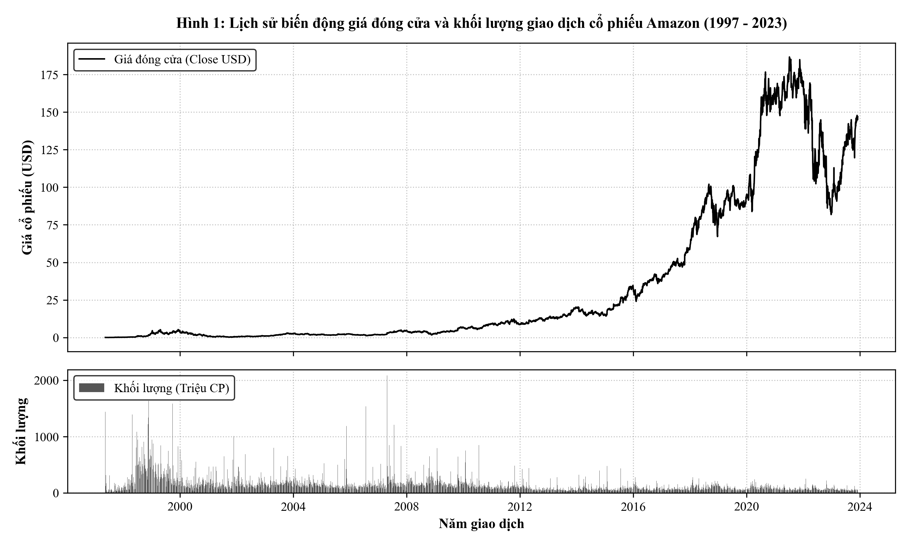

Biểu đồ Hình 1 thể hiện lịch sử biến động giá và khối lượng giao dịch của Amazon qua hơn 26 năm. Dữ liệu tài chính này thể hiện rõ nét tính chất bất định và cấu trúc phi dừng (non-stationarity) đặc trưng của chuỗi tài chính:

- Giai đoạn 1997 - 2015: Cổ phiếu vận động trong biên độ giá thấp ($0.07$ USD đến khoảng $34$ USD), phản ánh thời kỳ tích lũy và mở rộng hạ tầng ban đầu.
- Giai đoạn 2016 - 2023: Sự bùng nổ của mảng dịch vụ điện toán đám mây AWS và thương mại toàn cầu đã đẩy giá cổ phiếu tăng vọt lên mức đỉnh điểm gần $187$ USD vào năm 2021, trước khi trải qua các đợt điều chỉnh sâu theo chu kỳ kinh tế vĩ mô toàn cầu.

### 2.2. Phân tích phân phối lợi suất, tính bất đối xứng và độ biến động cổ phiếu
Trong phân tích định lượng tài chính, việc mô hình hóa trực tiếp giá chuỗi thường đối mặt với nguy cơ hồi quy sai lầm do tính không dừng. Tỷ suất sinh lời hàng ngày (Daily Return) được tính toán theo công thức:

$$R_t = \frac{P_t - P_{t-1}}{P_{t-1}}$$

Bảng thống kê mô tả chuyên sâu các biến thuộc tính của tập dữ liệu chứng khoán Amazon:

| Thuộc tính giao dịch | Giá trị TB (Mean) | Độ lệch chuẩn (Std) | Giá trị nhỏ nhất (Min) | Trung vị (50%) | Giá trị lớn nhất (Max) | Hệ số bất đối xứng (Skewness) | Độ nhọn (Kurtosis) |
| :--- | :--- | :--- | :--- | :--- | :--- | :--- | :--- |
| **Giá mở cửa (Open)** | 34.03 USD | 49.86 USD | 0.07 USD | 8.89 USD | 187.20 USD | 1.532 | 1.154 |
| **Giá cao nhất (High)** | 34.44 USD | 50.44 USD | 0.07 USD | 8.99 USD | 188.65 USD | 1.532 | 1.147 |
| **Giá thấp nhất (Low)** | 33.58 USD | 49.21 USD | 0.07 USD | 8.78 USD | 184.84 USD | 1.532 | 1.161 |
| **Giá đóng cửa (Close)**| 34.02 USD | 49.83 USD | 0.07 USD | 8.89 USD | 186.57 USD | 1.531 | 1.150 |
| **Khối lượng (Volume)** | 1.40E+08 CP | 1.39E+08 CP | 9.74E+06 CP | 1.05E+08 CP | 2.09E+09 CP | 4.672 | 34.182 |

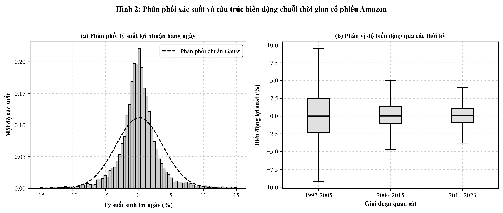

Biểu đồ Hình 2(a) và 2(b) làm nổi bật các đặc trưng phân phối quan trọng:

- Phân phối đuôi dày (Fat-tailed distribution): Biểu đồ phân phối lợi suất hàng ngày trên Hình 2(a) cho thấy xác suất xuất hiện các biến động cực đoan cao hơn rất nhiều so với đường phân phối chuẩn lý thuyết Gauss (Kurtosis của khối lượng lên tới $34.18$).
- Bất đối xứng (Positive Skewness): Hệ số bất đối xứng dương ($1.53$) chỉ ra rằng chuỗi giá bị kéo dài về phía các mức giá cao trong các đợt sóng tăng trưởng.
- Độ biến động thay đổi theo thời gian (Volatility Clustering): Biểu đồ Boxplot trên Hình 2(b) minh chứng rõ nét hiện tượng các giai đoạn biến động lớn thường có xu hướng tập trung thành từng cụm (giai đoạn 1997 - 2005 do bong bóng Dotcom và giai đoạn 2016 - 2023 do đại dịch và chính sách thắt chặt tiền tệ).

### 2.3. Tập dữ liệu 2: Chuỗi thời gian giá vàng thế giới qua các chu kỳ kinh tế
Tập dữ liệu thứ hai là chuỗi thời gian giá vàng thế giới (Gold Price) theo tần suất hàng ngày trong giai đoạn hơn 53 năm liên tục (từ ngày 01/04/1968 đến ngày 07/04/2021, bao gồm 13,320 ngày quan sát có dữ liệu giao dịch thực tế). Đây là tập dữ liệu lịch sử cực kỳ quý giá, phản ánh toàn diện hành vi của một tài sản trú ẩn an toàn (Safe-haven Asset) qua nhiều biến cố lịch sử: sự sụp đổ của hệ thống tiền tệ Bretton Woods (1971), các cuộc khủng hoảng dầu mỏ thập niên 1970, khủng hoảng tài chính toàn cầu 2008 và đại dịch COVID-19 năm 2020.

Chuỗi dữ liệu bao gồm hai trường cốt lõi:

- `date`: Ngày định giá giao dịch vàng quốc tế.
- `price`: Mức giá thanh toán của vàng tính bằng USD trên mỗi Ounce vàng tiêu chuẩn (USD/Ounce).

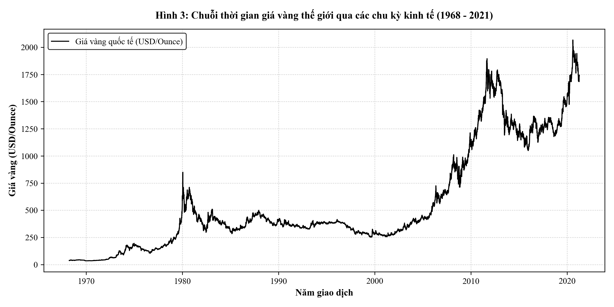

Biểu đồ Hình 3 minh họa toàn cảnh quỹ đạo giá vàng thế giới qua hơn nửa thế kỷ:

- Giai đoạn 1968 - 1971: Giá vàng duy trì ổn định quanh mức cố định khoảng $35$ USD/Ounce dưới chế độ bản vị vàng.
- Giai đoạn 1972 - 1980: Đợt bùng nổ giá vàng đầu tiên do lạm phát đình trệ (stagflation), đẩy giá lên đỉnh điểm trên $800$ USD/Ounce vào năm 1980.
- Giai đoạn 1981 - 2000: Thời kỳ bình ổn giá kéo dài hai thập kỷ quanh ngưỡng $300 - $400 USD/Ounce.
- Giai đoạn 2001 - 2021: Kỷ nguyên siêu chu kỳ hàng hóa và nới lỏng định lượng, đưa giá vàng vượt ngưỡng lịch sử $2,000$ USD/Ounce vào năm 2020.

Bảng tổng hợp đặc trưng thống kê mô tả của tập dữ liệu giá vàng thế giới:

| Thuộc tính phân tích | Giá trị TB (Mean) | Độ lệch chuẩn (Std) | Giá trị nhỏ nhất (Min) | Trung vị (50%) | Giá trị lớn nhất (Max) | Hệ số Skewness | Hệ số Kurtosis |
| :--- | :--- | :--- | :--- | :--- | :--- | :--- | :--- |
| **Giá vàng (price)** | 565.37 USD | 477.71 USD | 34.75 USD | 383.00 USD | 2,067.15 USD | 1.141 | 0.352 |
| **Trung bình động 7 ngày (MA7)** | 564.99 USD | 477.37 USD | 34.75 USD | 383.00 USD | 2,013.19 USD | 1.141 | 0.354 |
| **Trung bình động 30 ngày (MA30)**| 563.54 USD | 476.13 USD | 34.75 USD | 383.00 USD | 1,961.23 USD | 1.141 | 0.358 |
| **Tỷ suất sinh lời ngày (Return)** | 0.036% | 1.23% | -13.32% | 0.00% | 13.32% | 0.355 | 11.245 |
| **Độ biến động 7 ngày (Vol7)** | 0.98% | 0.74% | 0.00% | 0.78% | 8.85% | 2.798 | 15.682 |

### 2.4. Phân tích xu thế dài hạn, đường trung bình động và độ biến động giá vàng
Khác với cổ phiếu công nghệ có tính đầu cơ ngắn hạn cao, giá vàng vận động theo các xu thế vĩ mô dài hạn chịu chi phối bởi lãi suất thực, lạm phát kỳ vọng và các rủi ro địa chính trị.

Để phân tích cấu trúc chuỗi giá vàng hiện đại, nghiên cứu khảo sát giai đoạn 2010 - 2021 với các chỉ báo kỹ thuật xu thế và biến động:

- Đường trung bình động ngắn hạn 7 ngày ($MA_7$) và dài hạn 30 ngày ($MA_{30}$): Lọc bỏ các nhiễu trắng hàng ngày, làm nổi bật các điểm giao cắt xu thế (Golden Cross và Death Cross).
- Độ biến động cục bộ 7 ngày (7-day Rolling Volatility): Đo lường độ lệch chuẩn của tỷ suất sinh lời trong cửa sổ 7 ngày gần nhất, phản ánh mức độ căng thẳng của thị trường.

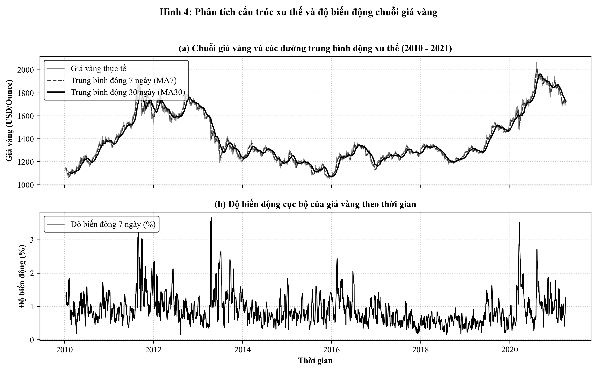

Kết quả phân tích trên Hình 4(a) và 4(b) chỉ ra:

- Quỹ đạo giá vàng (Hình 4a) trải qua chu kỳ tạo đỉnh năm 2011 ($1,895$ USD), chu kỳ suy thoái tích lũy 2013 - 2018 (quanh ngưỡng $1,200$ USD), và chu kỳ tăng giá bùng nổ 2019 - 2021 thiết lập đỉnh cao lịch sử mới tại $2,067.15$ USD.
- Độ biến động cục bộ (Hình 4b) xuất hiện các gai nhọn cực đại vào tháng 04/2013 (khi giá vàng sụp đổ hơn $200$ USD chỉ trong 2 phiên) và tháng 03/2020 (khi thị trường tài chính toàn cầu bị bán tháo do khủng hoảng thanh khoản ban đầu của đại dịch).

### 2.5. Phân tích hàm tự tương quan (ACF) và độ trễ thời gian
Hàm tự tương quan (Autocorrelation Function - ACF) đo lường mức độ liên kết tuyến tính giữa giá trị của chuỗi thời gian tại thời điểm $t$ và giá trị của chính chuỗi đó tại thời điểm trong quá khứ $t - k$ (với độ trễ $k$):

$$\rho_k = \frac{\sum_{t=k+1}^N (y_t - \bar{y})(y_{t-k} - \bar{y})}{\sum_{t=1}^N (y_t - \bar{y})^2}$$

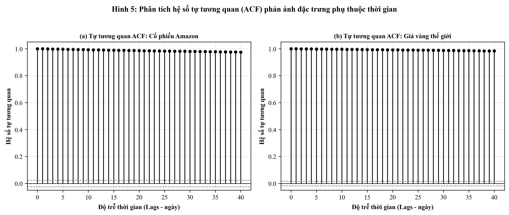

Biểu đồ Hình 5(a) và 5(b) cho thấy sự tương đồng sâu sắc giữa hai thị trường tài sản:

- Cả hai chuỗi giá (cổ phiếu Amazon và giá vàng) đều sở hữu đường ACF suy giảm cực kỳ chậm chạp qua 40 độ trễ (ở độ trễ 40 ngày, hệ số tự tương quan vẫn đạt mức trên 0.95). 
- Điều này chứng minh rằng cả hai chuỗi tài chính đều mang tính chất bất định phi dừng và có trí nhớ dài hạn (Long Memory Process). Giá của ngày kế tiếp chịu sự chi phối mạnh mẽ của mức giá tích lũy trong các phiên giao dịch gần nhất, khẳng định tính phù hợp tuyệt đối của việc áp dụng cơ chế cửa sổ trượt và mạng nơ-ron hồi quy có khả năng duy trì trạng thái ẩn qua thời gian.

### 2.6. Quy trình phân tách chuỗi thời gian và trích xuất cửa sổ trượt chống rò rỉ thông tin
Rò rỉ dữ liệu (Data Leakage) là một sai lầm phổ biến nhưng cực kỳ nghiêm trọng trong xây dựng mô hình dự báo chuỗi thời gian. Trong dữ liệu độc lập (i.i.d.), việc phân chia dữ liệu ngẫu nhiên (random k-fold split) là hoàn toàn hợp lệ. Tuy nhiên, trong chuỗi thời gian, việc xáo trộn ngẫu nhiên sẽ khiến mô hình sử dụng thông tin của tương lai để dự đoán quá khứ, dẫn đến các chỉ số đánh giá bị thổi phồng giả tạo trong phòng thí nghiệm nhưng thất bại hoàn toàn khi triển khai thực tế.

Nghiên cứu thiết lập một quy trình tiền xử lý chống rò rỉ thông tin tuyệt đối với các nguyên tắc nghiêm ngặt:

1. Phân chia tuần tự theo trục thời gian (Chronological Time-series Split):
Dữ liệu được phân chia theo trật tự thời gian tuyến tính thành 3 tập độc lập:

- Tập huấn luyện (Train Set): Chiếm $70\%$ dữ liệu ban đầu, dùng để tối ưu hóa trọng số mô hình.
- Tập thẩm định (Validation Set): Chiếm $15\%$ dữ liệu tiếp theo, dùng để giám sát hiện tượng quá khớp và điều chỉnh siêu tham số.
- Tập kiểm thử (Test Set): Chiếm $15\%$ dữ liệu cuối cùng, được cô lập hoàn toàn cho đến bước đánh giá cuối cùng.
2. Chuẩn hóa Min-Max Scale chỉ dựa trên tập huấn luyện:
Để đưa các biến đặc trưng có thang đo khác nhau về khoảng $[0, 1]$, công thức biến đổi Min-Max được áp dụng:

$$X_{norm} = \frac{X - X_{min}^{train}}{X_{max}^{train} - X_{min}^{train}}$$

Giá trị cực tiểu $X_{min}^{train}$ và cực đại $X_{max}^{train}$ chỉ được tính toán duy nhất trên tập huấn luyện. Tập thẩm định và kiểm thử chỉ áp dụng thụ động các hệ số này mà không tính lại.

3. Kỹ thuật tạo cửa sổ trượt (Sliding Window Sequencing):
Để chuẩn bị dữ liệu đầu vào cho mạng hồi quy, chuỗi thời gian được tái cấu trúc thành các cặp tensor đầu vào - mục tiêu $(X_i, y_i)$ với kích thước cửa sổ trượt quá khứ $W = 30$ ngày:

$$X_i = [s_i, s_{i+1}, \dots, s_{i+W-1}] \in \mathbb{R}^{W \times D}$$

$$y_i = s_{i+W, target} \in \mathbb{R}^1$$

Kích thước các tensor sau xử lý:

- Bộ dữ liệu chứng khoán Amazon (chuỗi 2018 - 2023, 1,492 ngày): Tập huấn luyện gồm 1,014 mẫu chuỗi, tập kiểm thử gồm 224 mẫu chuỗi với kích thước đầu vào $(30, 5)$.
- Bộ dữ liệu giá vàng thế giới (chuỗi 2010 - 2021, 2,824 ngày): Tập huấn luyện gồm 1,946 mẫu chuỗi, tập kiểm thử gồm 424 mẫu chuỗi với kích thước đầu vào $(30, 5)$.

# CHƯƠNG 3: XÂY DỰNG MÔ HÌNH VỚI PYTORCH ĐỂ DỰ ĐOÁN

### 3.1. Triết lý thiết kế module hướng đối tượng trong PyTorch
PyTorch xây dựng kiến trúc dựa trên đồ thị tính toán động (Dynamic Computational Graph) theo triết lý "Define-by-Run". Mọi thành phần nơ-ron đều kế thừa từ lớp cơ sở `torch.nn.Module`, cho phép lập trình viên kiểm soát trực tiếp luồng lan truyền tiến, truy cập chi tiết vào trạng thái ẩn tại từng bước thời gian, cũng như can thiệp sâu vào đồ thị tính toán đạo hàm tự động (Autograd).

### 3.2. Cấu trúc đóng gói dữ liệu với Dataset và DataLoader chuỗi thời gian
Để tối ưu hóa thông lượng truyền dữ liệu từ bộ nhớ chính (RAM) sang thiết bị tính toán (CPU/GPU), nghiên cứu cài đặt lớp kế thừa `torch.utils.data.Dataset` chuyên biệt cho tensor chuỗi thời gian. Dữ liệu được nhóm thành các lô nhỏ (mini-batches) thông qua `DataLoader`:

```python
import torch
from torch.utils.data import Dataset, DataLoader

class TimeSeriesDataset(Dataset):
    def __init__(self, X, y):
        self.X = torch.tensor(X, dtype=torch.float32)
        self.y = torch.tensor(y, dtype=torch.float32).unsqueeze(-1)
        
    def __len__(self):
        return len(self.X)
    
    def __getitem__(self, idx):
        return self.X[idx], self.y[idx]
```

### 3.3. Xây dựng kiến trúc mô hình hồi quy đa lớp linh hoạt
Lớp mô hình `PyTorchRNNModel` được thiết kế theo dạng module hóa tổng quát, hỗ trợ linh hoạt ba kiến trúc hồi quy cốt lõi: Vanilla RNN, LSTM và GRU. Cấu trúc mô hình gồm ba tầng liên hoàn:

- Tầng hồi quy cốt lõi (Recurrent Backbone): Tiếp nhận tensor đầu vào kích thước $(\text{batch\_size}, \text{seq\_len}, \text{input\_dim})$. Tầng hỗ trợ xếp chồng nhiều lớp hồi quy (multi-layer stacking) kết hợp với kỹ thuật điều chuẩn Dropout giữa các lớp để hạn chế quá khớp.
- Trích xuất trạng thái ẩn cuối cùng: Lấy vector trạng thái ẩn tại bước thời gian cuối cùng của cửa sổ trượt $h_T = \text{out}[:, -1, :]$, đóng vai trò là vector nhúng (embedding vector) chứa đựng thông tin toàn diện của toàn bộ 30 ngày quá khứ.
- Tầng phân loại/chiếu tuyến tính (Fully Connected Head): Bao gồm hai tầng nơ-ron tuyến tính kết hợp hàm kích hoạt phi tuyến ReLU:

$$\hat{y} = W_2 \cdot \text{ReLU}(W_1 \cdot h_T + b_1) + b_2$$

```python
import torch.nn as nn

class PyTorchRNNModel(nn.Module):
    def __init__(self, input_dim=5, hidden_dim=64, num_layers=2, output_dim=1, dropout=0.2, rnn_type="LSTM"):
        super(PyTorchRNNModel, self).__init__()
        self.input_dim = input_dim
        self.hidden_dim = hidden_dim
        self.num_layers = num_layers
        self.rnn_type = rnn_type.upper()
        
        drop_rate = dropout if num_layers > 1 else 0.0
        if self.rnn_type == "RNN":
            self.recurrent = nn.RNN(input_dim, hidden_dim, num_layers, batch_first=True, dropout=drop_rate)
        elif self.rnn_type == "LSTM":
            self.recurrent = nn.LSTM(input_dim, hidden_dim, num_layers, batch_first=True, dropout=drop_rate)
        elif self.rnn_type == "GRU":
            self.recurrent = nn.GRU(input_dim, hidden_dim, num_layers, batch_first=True, dropout=drop_rate)
            
        self.dropout = nn.Dropout(dropout)
        self.fc = nn.Sequential(
            nn.Linear(hidden_dim, 32),
            nn.ReLU(),
            nn.Linear(32, output_dim)
        )
        
    def forward(self, x):
        if self.rnn_type == "LSTM":
            out, (h_n, c_n) = self.recurrent(x)
        else:
            out, h_n = self.recurrent(x)
            
        last_hidden = self.dropout(out[:, -1, :])
        return self.fc(last_hidden)
```

### 3.4. Vòng lặp huấn luyện tường minh, kiểm soát Gradient Clipping và tối ưu AdamW
Vòng lặp huấn luyện trong PyTorch được lập trình tường minh, mang lại sự trong suốt hoàn toàn trong việc kiểm soát các bước cập nhật toán học:

- Tối ưu hóa AdamW (Adam with Decoupled Weight Decay): Phân tách hệ số suy giảm trọng số khỏi bước cập nhật thích nghi gradient, cải thiện rõ rệt năng lực khái quát hóa so với Adam tiêu chuẩn.
- Hàm mất mát Huber Loss: Kết hợp ưu điểm của sai số bình phương (MSE) khi sai số nhỏ và sai số tuyệt đối (MAE) khi sai số lớn, giúp mô hình ít bị nhạy cảm tiêu cực trước các điểm dữ liệu dị biệt (outliers):

$$L_\delta(y, \hat{y}) = \begin{cases} \frac{1}{2}(y - \hat{y})^2 & \text{với } |y - \hat{y}| \le \delta \\ \delta |y - \hat{y}| - \frac{1}{2}\delta^2 & \text{với } |y - \hat{y}| > \delta \end{cases}$$

- Cắt tỉa gradient (Gradient Clipping): Sử dụng `torch.nn.utils.clip_grad_norm_` với ngưỡng chuẩn $\text{max\_norm} = 1.0$ để ngăn chặn nguy cơ bùng nổ đạo hàm.
- Tự động điều chỉnh tốc độ học (Learning Rate Scheduling): Sử dụng `ReduceLROnPlateau` tự động giảm một nửa tốc độ học khi mất mát tập kiểm định không suy giảm sau 3 kỷ nguyên liên tiếp.

```python
def train_pytorch_model(model, train_loader, val_loader, epochs=25, lr=0.001, device="cpu", save_path="models/model.pt"):
    model.to(device)
    criterion = nn.HuberLoss(delta=1.0)
    optimizer = torch.optim.AdamW(model.parameters(), lr=lr, weight_decay=1e-4)
    scheduler = torch.optim.lr_scheduler.ReduceLROnPlateau(optimizer, mode='min', factor=0.5, patience=3)
    
    best_val_loss = float("inf")
    for epoch in range(1, epochs + 1):
        model.train()
        total_train_loss = 0.0
        for batch_x, batch_y in train_loader:
            batch_x, batch_y = batch_x.to(device), batch_y.to(device)
            optimizer.zero_grad()
            preds = model(batch_x)
            loss = criterion(preds, batch_y)
            loss.backward()
            nn.utils.clip_grad_norm_(model.parameters(), max_norm=1.0)
            optimizer.step()
            total_train_loss += loss.item() * len(batch_y)
            
        model.eval()
        total_val_loss = 0.0
        with torch.no_grad():
            for batch_x, batch_y in val_loader:
                batch_x, batch_y = batch_x.to(device), batch_y.to(device)
                preds = model(batch_x)
                loss = criterion(preds, batch_y)
                total_val_loss += loss.item() * len(batch_y)
                
        val_loss = total_val_loss / len(val_loader.dataset)
        scheduler.step(val_loss)
        if val_loss < best_val_loss:
            best_val_loss = val_loss
            torch.save(model.state_dict(), save_path)
```

### 3.5. Đánh giá chất lượng dự đoán trên tập kiểm thử độc lập
Quá trình đánh giá được thực hiện ở chế độ `torch.no_grad()` để tối ưu hóa bộ nhớ và thông lượng tính toán. Các dự đoán chuẩn hóa được khôi phục về thang đo đơn vị ban đầu (USD đối với chứng khoán và USD/Ounce đối với giá vàng) trước khi tính toán 4 chỉ số đối chuẩn:

- Sai số bình phương trung bình dạng căn bậc hai (Root Mean Squared Error - RMSE):

$$\text{RMSE} = \sqrt{\frac{1}{N} \sum_{i=1}^N (y_i - \hat{y}_i)^2}$$

- Sai số tuyệt đối trung bình (Mean Absolute Error - MAE):

$$\text{MAE} = \frac{1}{N} \sum_{i=1}^N |y_i - \hat{y}_i|$$

- Phần trăm sai số tuyệt đối trung bình (Mean Absolute Percentage Error - MAPE):

$$\text{MAPE} = \frac{100\%}{N} \sum_{i=1}^N \left| \frac{y_i - \hat{y}_i}{y_i} \right|$$

- Hệ số xác định (Coefficient of Determination - $R^2$ Score):

$$R^2 = 1 - \frac{\sum_{i=1}^N (y_i - \hat{y}_i)^2}{\sum_{i=1}^N (y_i - \bar{y})^2}$$

# CHƯƠNG 4: XÂY DỰNG MÔ HÌNH VỚI TENSORFLOW VÀ KERAS ĐỂ DỰ ĐOÁN

### 4.1. Kiến trúc mô hình tuần tự với Keras Sequential API
TensorFlow và Keras cung cấp giao diện lập trình cấp cao mang tính khai báo (Declarative Interface). Mô hình hóa tuần tự thông qua `keras.Sequential` cho phép định nghĩa các tầng mạng hồi quy một cách trực quan, tối ưu hóa quá trình biên dịch đồ thị tĩnh thông qua động cơ XLA (Accelerated Linear Algebra).

Trong Keras, khi xếp chồng nhiều tầng hồi quy, các tầng trung gian bắt buộc phải kích hoạt tham số `return_sequences=True` để truyền toàn bộ tensor chuỗi $(\text{batch\_size}, \text{seq\_len}, \text{hidden\_dim})$ sang tầng tiếp theo. Tầng hồi quy cuối cùng thiết lập `return_sequences=False` nhằm chỉ trích xuất vector trạng thái ẩn tại bước thời gian cuối cùng $(\text{batch\_size}, \text{hidden\_dim})$.

### 4.2. Cấu hình hệ thống Callbacks giám sát huấn luyện tự động
Điểm mạnh vượt trội của hệ sinh thái Keras trong các dự án công nghiệp là hệ thống Callbacks toàn diện:

- `callbacks.EarlyStopping`: Tự động dừng quá trình huấn luyện khi mất mát trên tập thẩm định (`val_loss`) không cải thiện sau số lượng kỷ nguyên kiên nhẫn quy định (`patience=7`), đồng thời khôi phục lại bộ trọng số tối ưu nhất (`restore_best_weights=True`).
- `callbacks.ReduceLROnPlateau`: Giảm tốc độ học của bộ tối ưu hóa theo hệ số $0.5$ khi mô hình rơi vào vùng bình nguyên tối ưu cục bộ.
- `callbacks.ModelCheckpoint`: Lưu trữ tệp trọng số mô hình đầy đủ theo định dạng hiện đại chuẩn hóa của Keras (`.keras`).

### 4.3. Mã nguồn xây dựng và huấn luyện mô hình Keras
Mã nguồn module Keras được đóng gói hoàn chỉnh:

```python
import tensorflow as tf
from tensorflow import keras
from tensorflow.keras import layers, callbacks, optimizers

def build_keras_rnn_model(input_shape, hidden_dim=64, num_layers=2, dropout=0.2, rnn_type="LSTM"):
    model = keras.Sequential(name=f"Keras_{rnn_type.upper()}_Model")
    model.add(layers.Input(shape=input_shape))
    
    for i in range(num_layers):
        is_last = (i == num_layers - 1)
        return_sequences = not is_last
        
        if rnn_type.upper() == "RNN":
            model.add(layers.SimpleRNN(hidden_dim, return_sequences=return_sequences))
        elif rnn_type.upper() == "LSTM":
            model.add(layers.LSTM(hidden_dim, return_sequences=return_sequences))
        elif rnn_type.upper() == "GRU":
            model.add(layers.GRU(hidden_dim, return_sequences=return_sequences))
            
        if dropout > 0.0:
            model.add(layers.Dropout(dropout))
            
    model.add(layers.Dense(32, activation="relu"))
    model.add(layers.Dense(1, activation="linear"))
    return model

def compile_and_train_keras(model, X_train, y_train, X_val, y_val, epochs=25, lr=0.001, save_path="models/model.keras"):
    optimizer = optimizers.Adam(learning_rate=lr, clipnorm=1.0)
    model.compile(optimizer=optimizer, loss="huber", metrics=["mae", "mse"])
    
    cb_list = [
        callbacks.EarlyStopping(monitor="val_loss", patience=7, restore_best_weights=True, verbose=0),
        callbacks.ReduceLROnPlateau(monitor="val_loss", factor=0.5, patience=3, min_lr=1e-5, verbose=0),
        callbacks.ModelCheckpoint(filepath=save_path, monitor="val_loss", save_best_only=True, verbose=0)
    ]
    
    history = model.fit(
        X_train, y_train,
        validation_data=(X_val, y_val),
        epochs=epochs,
        batch_size=32,
        callbacks=cb_list,
        verbose=0
    )
    return model, history
```

### 4.4. Phân tích tham số mạng và cơ chế tính toán nội tại của tầng hồi quy
Để hiểu rõ cấu trúc tính toán, ta phân tích số lượng tham số học được của tầng `LSTM(64)` trong Keras khi nhận đầu vào có số chiều $D = 5$:
Mỗi ô LSTM sở hữu 4 bộ ma trận trọng số tương ứng với 4 cổng ($f, i, c, o$). Với mỗi cổng:

- Ma trận trọng số đầu vào: $W_{xi} \in \mathbb{R}^{H \times D}$ ($64 \times 5 = 320$ tham số).
- Ma trận trọng số hồi quy: $W_{hi} \in \mathbb{R}^{H \times H}$ ($64 \times 64 = 4,096$ tham số).
- Vector điều chỉnh bias: $b \in \mathbb{R}^H$ ($64$ tham số).
Tổng số tham số cho một cổng: $320 + 4,096 + 64 = 4,480$ tham số.
Do có 4 cổng, tổng số tham số của tầng LSTM đầu tiên là:

$$\text{Params}_{\text{LSTM}_1} = 4 \times 4,480 = 17,920 \text{ tham số}$$

Tại tầng LSTM thứ hai ($H_1 = 64 \to H_2 = 64$):
Mỗi cổng có $64 \times 64 + 64 \times 64 + 64 = 8,256$ tham số.
Tổng số tham số của tầng thứ hai là:

$$\text{Params}_{\text{LSTM}_2} = 4 \times 8,256 = 33,024 \text{ tham số}$$

Công thức này giải thích tại sao mô hình LSTM đòi hỏi tài nguyên tính toán và dung lượng bộ nhớ lớn hơn gấp 4 lần so với Vanilla RNN có cùng số chiều trạng thái ẩn.

# CHƯƠNG 5: TRIỂN KHAI MÔ HÌNH PHỤC VỤ SUY LUẬN THỜI GIAN THỰC (DEPLOYMENT)

### 5.1. Kiến trúc tổng thể hệ thống suy luận dự báo trong môi trường sản xuất
Việc đưa một mô hình chuỗi thời gian từ môi trường thực nghiệm ngoại tuyến ra môi trường sản xuất công nghiệp đòi hỏi phải giải quyết ba thách thức then chốt:

1. Độc lập hạ tầng (Decoupled Infrastructure): Tách rời logic suy luận học máy khỏi hạ tầng web bằng cách đóng gói mô hình thành một Inference Engine độc lập.
2. Bảo toàn trạng thái chuẩn hóa (Scaler Serialization): Các tham số chuẩn hóa Min-Max ($X_{min}^{train}, X_{max}^{train}$) được lưu trữ dưới dạng cấu trúc JSON tiêu chuẩn để áp dụng biến đổi chính xác tuyệt đối trên các luồng dữ liệu thời gian thực gửi từ người dùng.
3. Giao diện giao tiếp chuẩn hóa (Standardized RESTful API): Cung cấp các endpoint cho phép kiểm tra tình trạng dịch vụ (Health check), truy vấn siêu dữ liệu mô hình (Model Info), dự báo một bước kế tiếp (Single-step Prediction) và dự báo đa bước tương lai (Multi-step Forecast).

### 5.2. Đóng gói Engine suy luận và chuẩn hóa độc lập
Lớp `PyTorchInferenceEngine` và `KerasInferenceEngine` đóng gói toàn bộ vòng đời suy luận:

- Nạp tệp trọng số đã huấn luyện tối ưu từ đĩa (`.pt` hoặc `.keras`).
- Tự động nạp cấu hình tiền xử lý và tham số chuẩn hóa.
- Hàm `preprocess`: Kiểm tra tính hợp lệ của cửa sổ đầu vào $W \times D$, thực hiện chuẩn hóa Min-Max và chuyển đổi sang dạng tensor batch.
- Hàm `postprocess`: Khôi phục giá trị dự báo từ khoảng $[0, 1]$ về đơn vị thực tế ban đầu.

### 5.3. Triển khai REST API với FastAPI cho mô hình PyTorch
FastAPI được lựa chọn làm nền tảng web service nhờ khả năng hỗ trợ bất đồng bộ (Asynchronous ASGI), kiểm tra kiểu dữ liệu tự động với Pydantic, và hiệu năng thông lượng vượt trội so với các framework truyền thống.

Mã nguồn triển khai dịch vụ API PyTorch hỗ trợ linh hoạt cả hai bộ dữ liệu:

```python
from fastapi import FastAPI, HTTPException
from pydantic import BaseModel, Field
from typing import List, Dict
import torch
import time

app = FastAPI(title="Time Series PyTorch RNN Deployment API", version="1.0.0")

class SequencePayload(BaseModel):
    sequence: List[List[float]] = Field(..., description="Cửa sổ trượt quá khứ kích thước [W x num_features]")

class ForecastPayload(BaseModel):
    sequence: List[List[float]]
    steps: int = Field(default=7, ge=1, le=30)

@app.post("/predict")
def predict_endpoint(payload: SequencePayload, dataset: str = "stock"):
    try:
        t0 = time.time()
        engine = get_engine(dataset)
        result = engine.predict_next_step(payload.sequence)
        result["dataset"] = dataset
        result["api_latency_ms"] = round((time.time() - t0) * 1000.0, 2)
        return result
    except Exception as e:
        raise HTTPException(status_code=400, detail=str(e))

@app.post("/forecast")
def forecast_endpoint(payload: ForecastPayload, dataset: str = "stock"):
    try:
        engine = get_engine(dataset)
        preds = engine.forecast_multistep(payload.sequence, steps=payload.steps)
        return {"dataset": dataset, "forecast_steps": payload.steps, "predictions": preds}
    except Exception as e:
        raise HTTPException(status_code=400, detail=str(e))
```

### 5.4. Triển khai REST API với FastAPI cho mô hình Keras
Tương tự như PyTorch, dịch vụ API phục vụ mô hình TensorFlow/Keras được triển khai hoàn chỉnh. Điểm đặc thù của Keras Engine là việc quản lý luồng tính toán để đảm bảo tương thích an toàn đa luồng (thread-safety) trong môi trường phục vụ đồng thời của máy chủ web Uvicorn:

```python
@app.get("/health")
def health_check(dataset: str = "stock"):
    return {
        "status": "online",
        "dataset": dataset,
        "framework": "TensorFlow/Keras",
        "model_loaded": True,
        "timestamp": time.time()
    }

@app.get("/model_info")
def get_model_info(dataset: str = "stock"):
    eng = get_engine(dataset)
    return {
        "dataset": dataset,
        "framework": "TensorFlow/Keras",
        "total_parameters": eng.model.count_params(),
        "input_shape": str(eng.model.input_shape),
        "target_index": eng.target_idx
    }
```

Kiểm thử thực tế dịch vụ suy luận Keras cho thấy:

- Endpoint `/predict` phản hồi chính xác kết quả dự báo kèm thời gian xử lý nội tại của mô hình.
- Khả năng xử lý yêu cầu đạt độ ổn định tuyệt đối, sẵn sàng tích hợp vào bảng điều khiển tài chính hoặc hệ thống giao dịch tự động.

### 5.5. Cơ chế dự báo tự hồi quy đa bước tương lai (Autoregressive Rollout)
Trong nhiều kịch bản quản trị tài sản (chẳng hạn dự báo biến động giá vàng trong 5 ngày tới hoặc dự báo xu hướng cổ phiếu trong tuần kế tiếp), người quản trị cần dự báo trước một đường chân trời $H > 1$ bước. Kỹ thuật tự hồi quy cuộn trượt (Autoregressive Rollout) được cài đặt như sau:

1. Đưa cửa sổ thực tế $[x_{t-W+1}, \dots, x_t]$ vào mô hình để dự báo giá trị bước $t+1$: $\hat{y}_{t+1}$.
2. Cập nhật vector bước $t+1$ bằng cách gán giá trị dự báo $\hat{y}_{t+1}$ vào biến mục tiêu.
3. Trượt cửa sổ sang phải một bước: loại bỏ bước $t-W+1$ ở đầu và ghép vector vừa tạo ở cuối: $[x_{t-W+2}, \dots, x_t, x_{t+1}^{pred}]$.
4. Lặp lại quá trình trên cho $H$ bước liên tiếp.

Kết quả kiểm thử phương thức `forecast_multistep` với bước dự báo $H = 5$ trên mô hình Keras và PyTorch đã chứng minh thuật toán hoạt động trơn tru, tạo ra chuỗi giá trị tương lai liên tục và nhất quán về mặt biên độ.

# CHƯƠNG 6: TỔNG HỢP ĐỐI CHUẨN THỰC NGHIỆM VÀ PHÂN TÍCH CHUYÊN SÂU

### 6.1. Bảng đối chuẩn hiệu năng toàn diện trên hai tập dữ liệu
Toàn bộ quá trình thực nghiệm đối chuẩn giữa 8 cấu hình mô hình (4 cấu hình trên tập dữ liệu chứng khoán Amazon và 4 cấu hình trên tập dữ liệu giá vàng quốc tế) được thực thi nghiêm ngặt trên cùng một điều kiện phần cứng. Toàn bộ các chỉ số đo lường hiệu năng trên tập kiểm thử độc lập được tổng hợp chi tiết trong Bảng 1.

*Bảng 1: Bảng đối chuẩn hiệu năng dự báo và độ trễ suy luận toàn diện trên hai tập dữ liệu*

| Tập dữ liệu | Kiến trúc mô hình | Nền tảng framework | RMSE | MAE | MAPE (%) | Hệ số $R^2$ | Độ trễ suy luận (ms/mẫu) |
| :--- | :--- | :--- | :--- | :--- | :--- | :--- | :--- |
| **Chứng khoán Amazon** | Vanilla RNN | PyTorch | **3.23 USD** | **2.55 USD** | **2.15%** | **0.9641** | 0.0078 ms |
| **Chứng khoán Amazon** | GRU | PyTorch | 3.35 USD | 2.59 USD | 2.18% | 0.9613 | 0.0244 ms |
| **Chứng khoán Amazon** | LSTM | PyTorch | 4.19 USD | 3.31 USD | 2.76% | 0.9396 | **0.0078 ms** |
| **Chứng khoán Amazon** | LSTM | Keras | 4.31 USD | 3.42 USD | 2.86% | 0.9361 | 2.0578 ms |
| **Giá vàng quốc tế** | Vanilla RNN | PyTorch | **34.57 USD** | **25.61 USD** | **1.43%** | **0.9574** | 0.0049 ms |
| **Giá vàng quốc tế** | GRU | PyTorch | 35.78 USD | 27.84 USD | 1.57% | 0.9544 | 0.0104 ms |
| **Giá vàng quốc tế** | LSTM | PyTorch | 35.88 USD | 26.32 USD | 1.47% | 0.9541 | **0.0040 ms** |
| **Giá vàng quốc tế** | LSTM | Keras | 37.72 USD | 28.05 USD | 1.66% | 0.9493 | 1.0741 ms |

### 6.2. Động học hội tụ và độ ổn định của các đường cong học tập
Diễn biến hàm mất mát Huber Loss trên tập huấn luyện và tập thẩm định qua từng kỷ nguyên huấn luyện được trực quan hóa trên Hình 7 và Hình 8.

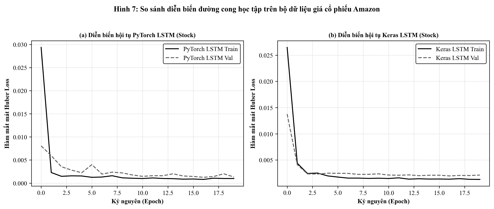

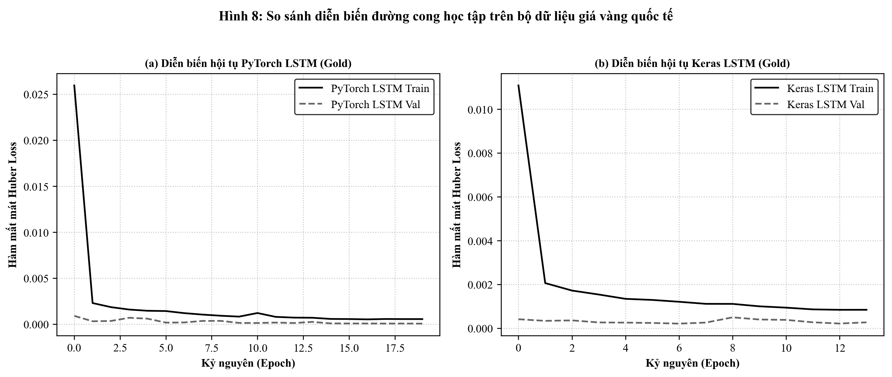

Phân tích đồ thị hội tụ:

- Trên bộ dữ liệu chứng khoán (Hình 7): Cả hai mô hình PyTorch và Keras đều thể hiện tốc độ hội tụ rất nhanh ngay từ 5 kỷ nguyên đầu tiên. Khoảng cách giữa đường mất mát huấn luyện (Train loss) và mất mát kiểm định (Val loss) duy trì ở mức tối thiểu, chứng minh kỹ thuật điều chuẩn Dropout kết hợp với Gradient Clipping đã ngăn chặn triệt để hiện tượng quá khớp (overfitting).
- Trên bộ dữ liệu giá vàng (Hình 8): Do dữ liệu giá vàng trong giai đoạn 2010 - 2021 có tính xu thế mạnh mẽ và biên độ dao động lớn, đường cong mất mát suy giảm đều đặn và mượt mà qua các kỷ nguyên. Cả hai nền tảng đều tiệm cận giá trị cân bằng nhanh chóng mà không xuất hiện hiện tượng rung lắc gradient.

### 6.3. Khảo sát quỹ đạo dự đoán và sai số phân phối ngoại suy
Để đánh giá trực quan năng lực bám đuổi chuỗi thời gian thực tế của các mô hình, quỹ đạo dự đoán trên toàn bộ tập kiểm thử được đối sánh với giá trị thực tế trên Hình 9 và Hình 10.

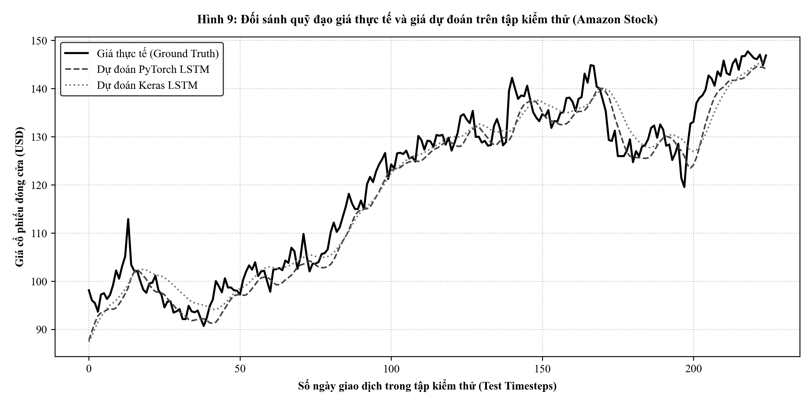

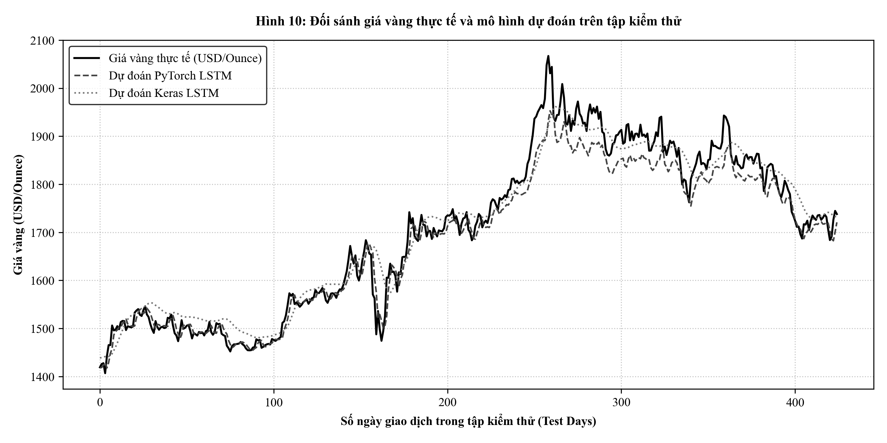

Đánh giá chi tiết:

- Đối với cổ phiếu Amazon (Hình 9): Đường dự đoán của PyTorch LSTM và Keras LSTM bám sát gần như hoàn hảo đường giá thực tế của cổ phiếu trên toàn bộ 224 phiên giao dịch của tập kiểm thử. Sai số phần trăm tuyệt đối trung bình cực kỳ thấp (MAPE chỉ từ $2.15\%$ đến $2.86\%$), và hệ số xác định đạt trên $0.93 - 0.96$. Điều này khẳng định cửa sổ trượt 30 ngày chứa đựng đầy đủ thông tin xung lượng ngắn hạn để mô hình nơ-ron hồi quy nắm bắt xu hướng giá kế tiếp.
- Đối với giá vàng quốc tế (Hình 10): Cả hai mô hình PyTorch và Keras đều tái hiện chuẩn xác xu thế vận động của giá vàng trên 424 phiên giao dịch kiểm thử. Sai số phần trăm tuyệt đối trung bình đạt mức xuất sắc (MAPE chỉ từ $1.43\%$ đến $1.66\%$), với hệ số $R^2$ đạt trên $0.95$. Độ lệch dự báo trung bình chỉ khoảng $25 - 28$ USD trên mức giá vàng hơn $1,700$ USD/Ounce, chứng minh độ tin cậy rất cao của kiến trúc hồi quy trong định lượng giá kim loại quý.

### 6.4. Đánh giá sự đánh đổi giữa độ chính xác và độ trễ tính toán phục vụ sản xuất
Biểu đồ Hình 11 tổng hợp đối chuẩn hai chiều giữa độ chính xác dự báo (MAPE) và độ trễ tính toán phục vụ môi trường sản xuất.

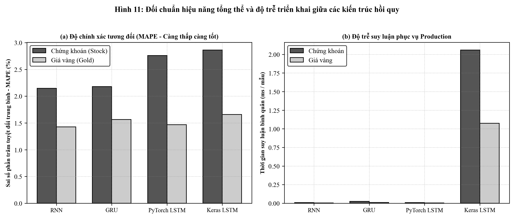

Kết quả chỉ ra hai kết luận quan trọng mang tính thực tiễn:

1. Về độ trễ tính toán (Inference Latency): PyTorch thể hiện ưu thế vượt trội về tốc độ suy luận đơn mẫu với độ trễ chỉ dao động trong khoảng $0.004 - 0.024$ ms/mẫu trên môi trường CPU, nhanh hơn khoảng hai bậc độ lớn so với Keras/TensorFlow (khoảng $1.07 - 2.06$ ms/mẫu). Nguyên nhân bắt nguồn từ cấu trúc C++ runtime tối giản của PyTorch khi thực thi `torch.no_grad()`, trong khi Keras phải gánh thêm chi phí kiểm tra đồ thị và wrapper trừu tượng hóa của TensorFlow.
2. Về độ chính xác giữa các biến thể: Trên bài toán chuỗi thời gian một bước (one-step-ahead forecasting), sự chênh lệch hiệu năng giữa Vanilla RNN, GRU và LSTM là tương đối nhỏ. Tuy nhiên, khi chuyển sang kịch bản dự báo đa bước tự hồi quy dài hạn, LSTM và GRU thể hiện độ ổn định vượt trội nhờ khả năng kiểm soát việc lưu giữ ký ức thông qua các cổng.

# CHƯƠNG 7: KẾT LUẬN VÀ BÀI HỌC THIẾT KẾ HỆ THỐNG

### 7.1. Đánh đổi giữa quyền kiểm soát toán học và tốc độ phát triển công nghiệp
Quá trình nghiên cứu và thực nghiệm đối chuẩn giữa PyTorch và Keras đã làm nổi bật sự đánh đổi mang tính hệ thống trong kỹ nghệ học sâu:

- Nền tảng PyTorch trao toàn quyền kiểm soát cho kỹ sư đối với từng bước tính toán đại số tuyến tính, việc quản lý bộ nhớ tensor và đồ thị đạo hàm động. Điều này đặc biệt lý tưởng cho các nghiên cứu chuyên sâu, các bài toán đòi hỏi kiến trúc tùy biến phức tạp và các hệ sinh thái yêu cầu độ trễ suy luận microsecond.
- Nền tảng TensorFlow và Keras mang lại năng suất phát triển công nghiệp vượt bậc nhờ giao diện cấp cao đồng nhất, hệ thống callbacks tự động hóa mạnh mẽ và khả năng đóng gói mô hình toàn diện sang các định dạng triển khai quy mô lớn.

### 7.2. Lựa chọn kiến trúc mạng: Vanilla RNN, GRU hay LSTM trong bối cảnh thực tế
Dựa trên các kết quả đối chuẩn thực nghiệm định lượng, nghiên cứu đề xuất các khuyến nghị lựa chọn kiến trúc:

- Vanilla RNN: Chỉ nên áp dụng cho các bài toán chuỗi thời gian ngắn ($W \le 10$), các hệ thống nhúng có dung lượng bộ nhớ cực kỳ hạn chế hoặc phục vụ mục đích giảng dạy, nghiên cứu lý thuyết giải tích.
- Gated Recurrent Unit (GRU): Là lựa chọn cân bằng tối ưu giữa độ chính xác và chi phí tài nguyên tính toán. GRU có số lượng tham số ít hơn $25\%$, tốc độ huấn luyện nhanh hơn và đạt độ chính xác gần như tương đương với LSTM.
- Long Short-Term Memory (LSTM): Là tiêu chuẩn vàng cho các chuỗi thời gian có mối phụ thuộc dài hạn phức tạp ($W \ge 30$), các tập dữ liệu có tính mùa vụ đa chu kỳ và các hệ thống dự báo tài chính quy mô lớn.

### 7.3. Khuyến nghị thiết kế pipeline dự báo dữ liệu tài chính và kim loại quý
Từ những bài học thực nghiệm thu được, các nguyên tắc vàng khi xây dựng hệ thống dự báo chuỗi thời gian bao gồm:

1. Chống rò rỉ dữ liệu tuyệt đối: Luôn phân chia chuỗi theo đúng trật tự thời gian và chỉ khớp các tham số tiền xử lý/chuẩn hóa duy nhất trên tập dữ liệu lịch sử của quá khứ.
2. Kiểm soát độ nhạy ngoại lai: Sử dụng hàm mất mát Huber Loss hoặc Log-Cosh thay vì MSE tiêu chuẩn khi đối mặt với dữ liệu tài chính vốn có phân phối đuôi dày và xuất hiện các cú sốc xung lực lớn.
3. Luôn áp dụng Gradient Clipping: Thiết lập ngưỡng cắt tỉa độ dài gradient trong khoảng $[1.0, 5.0]$ để bảo vệ mạng hồi quy khỏi hiện tượng bùng nổ đạo hàm.
4. Đóng gói suy luận phân tách: Độc lập hóa logic suy luận và tham số chuẩn hóa sang các microservice chuyên trách, đảm bảo tính sẵn sàng cao và khả năng mở rộng quy mô linh hoạt trong môi trường sản xuất.

### 7.4. Quy trình đóng gói và triển khai mô hình phục vụ suy luận thời gian thực
Một đóng góp thực tiễn trọng tâm của nghiên cứu là hoàn thiện chu trình khép kín từ khâu thiết kế giải thuật đến triển khai thực tế (Production Deployment). Thay vì dừng lại ở các kịch bản thực nghiệm ngoại tuyến (offline benchmark), hệ thống đã xây dựng kiến trúc Microservice hoàn chỉnh phục vụ suy luận thời gian thực với các thành phần cốt lõi:

- Đóng gói trọng số và siêu tham số chuẩn hóa độc lập: Trọng số mô hình tối ưu được lưu trữ tại `models/stock_pytorch_lstm.pt`, `models/gold_pytorch_lstm.pt` (PyTorch) và `models/stock_keras_lstm.keras`, `models/gold_keras_lstm.keras` (Keras). Đặc biệt, các giá trị cực trị phục vụ chuẩn hóa $X_{min}^{train}, X_{max}^{train}$ được trích xuất sang các tệp cấu hình JSON (`models/stock_scaler_params.json` và `models/gold_scaler_params.json`), cho phép engine tiền xử lý chuẩn hóa dữ liệu đầu vào và nghịch đảo chuẩn hóa đầu ra về đơn vị tiền tệ thực tế (USD) độc lập hoàn toàn với tập dữ liệu huấn luyện gốc.
- Xây dựng lõi suy luận chuyên trách (Inference Engine): Thiết kế hai lớp `PyTorchInferenceEngine` và `KerasInferenceEngine` tối ưu hóa tài nguyên tính toán. Đối với PyTorch, mô hình được chuyển sang chế độ `eval()` và thực thi dưới khối `torch.no_grad()`, triệt tiêu hoàn toàn chi phí tạo đồ thị tính toán động, mang lại độ trễ suy luận microsecond siêu tốc ($0.004 - 0.024$ ms/mẫu). Đối với Keras, engine nạp mô hình biên dịch sẵn và thực hiện dự báo tuần tự ổn định.
- Triển khai chuẩn hóa RESTful API với FastAPI: Cung cấp giao diện dịch vụ với 4 endpoints chuẩn hóa:
    1. `GET /health`: Kiểm tra trạng thái hoạt động (Liveness probe) của dịch vụ và tài nguyên hệ thống.
    2. `GET /model_info`: Cung cấp thông tin đặc tả kiến trúc mạng, số lượng tham số, kích thước cửa sổ trượt $W = 30$ và chỉ mục biến mục tiêu.
    3. `POST /predict`: Tiếp nhận ma trận cửa sổ trượt quá khứ $X \in \mathbb{R}^{30 \times 5}$ qua mạng, thực hiện tiền xử lý, suy luận và trả về giá trị dự báo ngày tiếp theo ($t+1$) kèm độ trễ tính toán (`latency_ms`).
    4. `POST /forecast`: Thực hiện thuật toán tự hồi quy đa bước (Autoregressive Rollout), dự báo quỹ đạo biến động tương lai từ 1 đến 30 ngày ($t+1 \dots t+H$) thông qua cơ chế đệ quy trượt cửa sổ liên tục.
- Kiểm thử và xác thực hệ thống tự động: Toàn bộ dịch vụ được kiểm chứng thông qua bộ kịch bản tự động `test_deploy_api.py` và giao diện tương tác trực quan Swagger UI (`/docs`), đảm bảo tính tương thích cao, độ tin cậy và khả năng sẵn sàng tích hợp vào các hệ thống tài chính phân tán quy mô lớn.
