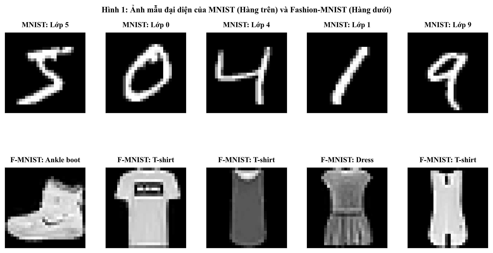
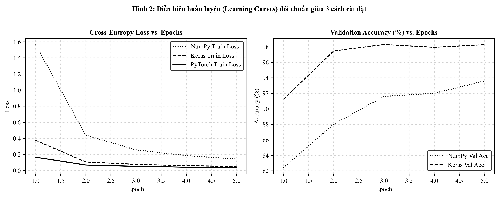
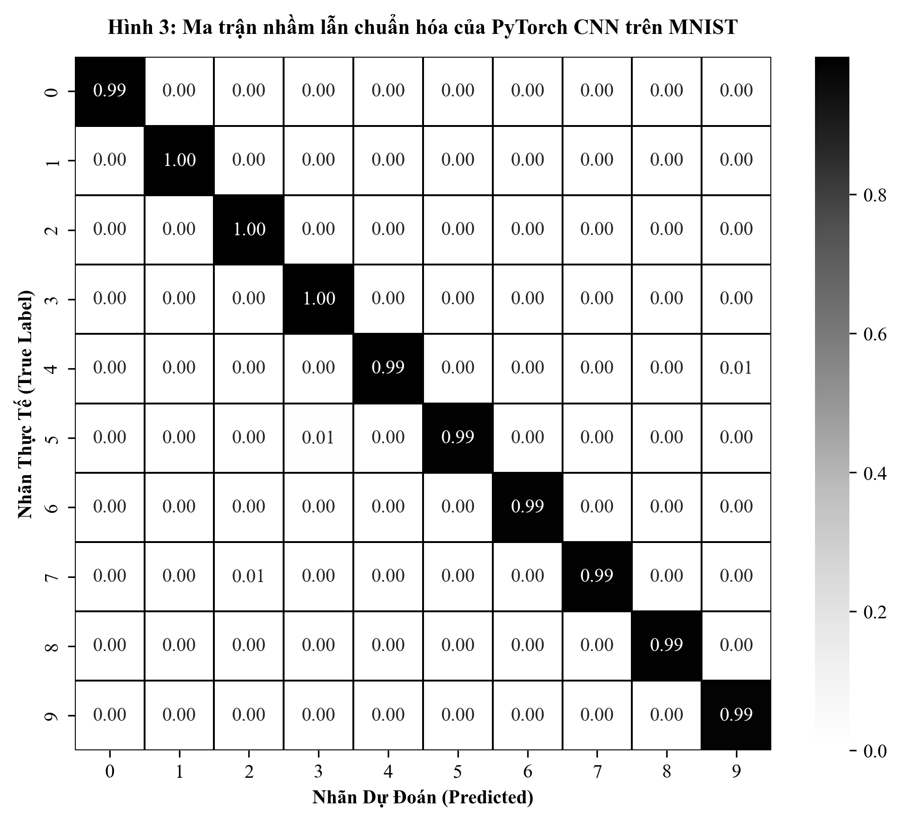
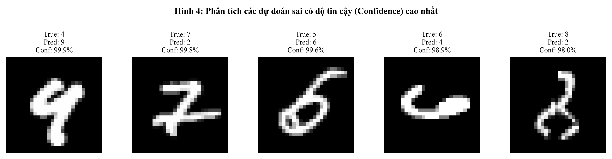

# MỤC LỤC

- [CHƯƠNG 1: QUY TRÌNH NẠP BA BỘ DỮ LIỆU VÀ TIỀN XỬ LÝ CHỐNG RÒ RỈ THÔNG TIN](#chương-1-quy-trình-nạp-ba-bộ-dữ-liệu-và-tiền-xử-lý-chống-rò-rỉ-thông-tin)
    - [1.1. Bối cảnh bài toán và đặc tả ba bộ dữ liệu thực nghiệm](#11-bối-cảnh-bài-toán-và-đặc-tả-ba-bộ-dữ-liệu-thực-nghiệm)
    - [1.2. Nguyên tắc vàng phòng chống rò rỉ dữ liệu](#12-nguyên-tắc-vàng-phòng-chống-rò-rỉ-dữ-liệu)
    - [1.3. Mã nguồn nạp và tiền xử lý dữ liệu](#13-mã-nguồn-nạp-và-tiền-xử-lý-dữ-liệu)
    - [1.4. Giải thích chi tiết các hàm trong quá trình nạp dữ liệu](#14-giải-thích-chi-tiết-các-hàm-trong-quá-trình-nạp-dữ-liệu)
- [CHƯƠNG 2: KHÁM PHÁ MÔ HÌNH CNN VÀ LỊCH SỬ TIẾN HÓA KIẾN TRÚC](#chương-2-khám-phá-mô-hình-cnn-và-lịch-sử-tiến-hóa-kiến-trúc)
    - [2.1. Bản chất mô hình nơ-ron tích chập dưới góc nhìn hợp thành hàm](#21-bản-chất-mô-hình-nơ-ron-tích-chập-dưới-góc-nhìn-hợp-thành-hàm)
    - [2.2. Cơ sở giải tích kích thước tensor và công thức tính tham số](#22-cơ-sở-giải-tích-kích-thước-tensor-và-công-thức-tính-tham-số)
    - [2.3. Mã nguồn khảo sát kích thước tensor và đếm số tham số](#23-mã-nguồn-khảo-sát-kích-thước-tensor-và-đếm-số-tham-số)
    - [2.4. Phân tích kết quả kiểm tra kích thước và tham số](#24-phân-tích-kết-quả-kiểm-tra-kích-thước-và-tham-số)
    - [2.5. Lịch sử và các kiến trúc cải tiến từ mô hình tích chập](#25-lịch-sử-và-các-kiến-trúc-cải-tiến-từ-mô-hình-tích-chập)
    - [2.6. Giải tích vùng cảm nhận qua các tầng mạng](#26-giải-tích-vùng-cảm-nhận-qua-các-tầng-mạng)
- [CHƯƠNG 3: XÂY DỰNG MÔ HÌNH TÍCH CHẬP TỪ ĐẦU BẰNG NUMPY THUẦN](#chương-3-xây-dựng-mô-hình-tích-chập-từ-đầu-bằng-numpy-thuần)
    - [3.1. Thiết kế kiến trúc và giải thuật tối ưu hóa im2col và col2im](#31-thiết-kế-kiến-trúc-và-giải-thuật-tối-ưu-hóa-im2col-và-col2im)
    - [3.2. Mã nguồn các tầng mạng tích chập tự xây dựng](#32-mã-nguồn-các-tầng-mạng-tích-chập-tự-xây-dựng)
    - [3.3. Mã nguồn hàm mất mát, bộ tối ưu hóa và mô hình hoàn chỉnh](#33-mã-nguồn-hàm-mất-mát-bộ-tối-ưu-hóa-và-mô-hình-hoàn-chỉnh)
    - [3.4. Giải thích chi tiết các hàm trong mô hình tự xây dựng](#34-giải-thích-chi-tiết-các-hàm-trong-mô-hình-tự-xây-dựng)
- [CHƯƠNG 4: XÂY DỰNG MÔ HÌNH VỚI TENSORFLOW VÀ KERAS](#chương-4-xây-dựng-mô-hình-với-tensorflow-và-keras)
    - [4.1. Thiết kế kiến trúc mô hình tuần tự](#41-thiết-kế-kiến-trúc-mô-hình-tuần-tự)
    - [4.2. Mã nguồn xây dựng và cấu hình mô hình Keras](#42-mã-nguồn-xây-dựng-và-cấu-hình-mô-hình-keras)
    - [4.3. Giải thích chi tiết các hàm trong mô hình Keras](#43-giải-thích-chi-tiết-các-hàm-trong-mô-hình-keras)
- [CHƯƠNG 5: XÂY DỰNG MÔ HÌNH VỚI PYTORCH](#chương-5-xây-dựng-mô-hình-với-pytorch)
    - [5.1. Triết lý thiết kế module của PyTorch](#51-triết-lý-thiết-kế-module-của-pytorch)
    - [5.2. Mã nguồn mô hình PyTorch và vòng lặp huấn luyện tường minh](#52-mã-nguồn-mô-hình-pytorch-và-vòng-lặp-huấn-luyện-tường-minh)
    - [5.3. Giải thích chi tiết các hàm trong mô hình PyTorch](#53-giải-thích-chi-tiết-các-hàm-trong-mô-hình-pytorch)
- [CHƯƠNG 6: TỔNG HỢP ĐỐI CHUẨN VÀ PHÂN TÍCH THỰC NGHIỆM](#chương-6-tổng-hợp-đối-chuẩn-và-phân-tích-thực-nghiệm)
    - [6.1. Bảng đối chuẩn hiệu năng giữa ba cách cài đặt](#61-bảng-đối-chuẩn-hiệu-năng-giữa-ba-cách-cài-đặt)
    - [6.2. Phân tích diễn biến học tập](#62-phân-tích-diễn-biến-học-tập)
    - [6.3. Ma trận nhầm lẫn chuẩn hóa](#63-ma-trận-nhầm-lẫn-chuẩn-hóa)
    - [6.4. Phân tích các trường hợp dự đoán sai có độ tin cậy cao](#64-phân-tích-các-trường-hợp-dự-đoán-sai-có-độ-tin-cậy-cao)
    - [6.5. Kiểm toán chi tiết các ca dự đoán sai lệch](#65-kiểm-toán-chi-tiết-các-ca-dự-đoán-sai-lệch)
    - [6.6. Mã nguồn tính toán chỉ số và vẽ biểu đồ thực nghiệm](#66-mã-nguồn-tính-toán-chỉ-số-và-vẽ-biểu-đồ-thực-nghiệm)
- [CHƯƠNG 7: KẾT LUẬN VÀ BÀI HỌC THIẾT KẾ KIẾN TRÚC](#chương-7-kết-luận-và-bài-học-thiết-kế-kiến-trúc)
    - [7.1. Đánh đổi giữa quyền kiểm soát toán học và năng suất công nghiệp](#71-đánh-đổi-giữa-quyền-kiểm-soát-toán-học-và-năng-suất-công-nghiệp)
    - [7.2. Giá trị của việc bảo tồn cấu trúc không gian hai chiều](#72-giá-trị-của-việc-bảo-tồn-cấu-trúc-không-gian-hai-chiều)
    - [7.3. Khuyến nghị thiết kế cho các hệ thống thị giác máy tính thực tế](#73-khuyến-nghị-thiết-kế-cho-các-hệ-thống-thị-giác-máy-tính-thực-tế)
    - [7.4. Khả năng tái lập kết quả và kho lưu trữ mã nguồn](#74-khả-năng-tái-lập-kết-quả-và-kho-lưu-trữ-mã-nguồn)

<div class="toc-separator" style="page-break-after: always; margin-bottom: 90px; padding-bottom: 40px;"></div>

# CHƯƠNG 1: QUY TRÌNH NẠP BA BỘ DỮ LIỆU VÀ TIỀN XỬ LÝ CHỐNG RÒ RỈ THÔNG TIN

### 1.1. Bối cảnh bài toán và đặc tả ba bộ dữ liệu thực nghiệm
Nhằm đánh giá toàn diện năng lực học biểu diễn của mô hình nơ-ron từ không gian ảnh cấu trúc hai chiều đến dữ liệu bảng, nghiên cứu thiết lập ba bộ dữ liệu độc lập:

#### 1. Bộ dữ liệu MNIST
MNIST gồm 70,000 ảnh xám kích thước $28 \times 28 \times 1$ thể hiện các chữ số viết tay từ 0 đến 9. Dữ liệu được phân chia sẵn thành 60,000 mẫu huấn luyện và 10,000 mẫu kiểm thử. Với nền đen đồng nhất, vật thể đơn lẻ nằm ở trung tâm và các nét bút rõ ràng, MNIST đóng vai trò là bộ chuẩn mực kiểm định tính đúng đắn của cấu trúc mạng và giải thuật lan truyền ngược tự xây dựng.

#### 2. Bộ dữ liệu Fashion-MNIST
Fashion-MNIST được thiết kế nhằm thay thế trực tiếp MNIST với cùng kích thước ảnh ($28 \times 28 \times 1$), cùng 70,000 mẫu và 10 lớp phân loại: Áo phông, Quần, Áo len chui đầu, Váy đầm, Áo khoác, Dép xăng-đan, Áo sơ-mi, Giày thể thao, Túi xách, Ủng cổ ngắn. Khác với chữ số đơn giản, sản phẩm may mặc sở hữu nhiều hoa văn, nếp gấp vải, độ tương phản ánh sáng đa dạng và ranh giới phân tách mờ nhạt giữa các lớp, tạo nên thử thách thị giác máy tính thực tế hơn.

#### 3. Bộ dữ liệu UCI Digits
Bộ dữ liệu gồm 1,797 mẫu chữ số được số hóa dưới dạng ma trận $8 \times 8$ và duỗi phẳng thành vector bảng 64 thuộc tính số học. Bộ dữ liệu này đóng vai trò đối chứng: làm nổi bật sự khác biệt sâu sắc giữa mô hình học máy xử lý vector thuộc tính phẳng không có thông tin vị trí lân cận và mạng nơ-ron tích chập có khả năng khai thác tương quan không gian hai chiều.



### 1.2. Nguyên tắc vàng phòng chống rò rỉ dữ liệu
Rò rỉ dữ liệu xảy ra khi bất kỳ thông tin thống kê nào của tập kiểm thử bị trộn lẫn vào quá trình huấn luyện mô hình. Điều này khiến mô hình ghi nhớ đặc tính của tập kiểm thử một cách thụ động, dẫn đến kết quả đánh giá bị sai lệch và mất độ tin cậy trong môi trường thực tế. 

Quy trình tiền xử lý tuân thủ nghiêm ngặt các nguyên tắc sau:

- Phân tách ba tập độc lập: Dữ liệu huấn luyện gốc được chia thành tập huấn luyện (54,000 mẫu, 90%) và tập thẩm định (6,000 mẫu, 10%) với việc cố định hạt giống ngẫu nhiên `seed=42`. Tập kiểm thử (10,000 mẫu) được cô lập tuyệt đối, không tham gia vào bất kỳ quyết định cập nhật trọng số, tinh chỉnh siêu tham số hay lựa chọn điểm dừng sớm nào.
- Chuẩn hóa theo phân phối tập huấn luyện: Công thức chuẩn hóa điểm ảnh $X_{norm} = (X - \mu) / \sigma$ sử dụng giá trị trung bình $\mu$ và độ lệch chuẩn $\sigma$ chỉ được tính toán duy nhất trên tập huấn luyện. Tập kiểm thử chỉ áp dụng thụ động các hệ số này mà không tính lại.

### 1.3. Mã nguồn nạp và tiền xử lý dữ liệu
Toàn bộ mã nguồn thực thi của bài toán, các cấu trúc mô hình tự xây dựng, mô hình Keras/PyTorch và sổ tay thí nghiệm được công khai tại GitHub: [https://github.com/LeeMinhPhuowng/Assignment04](https://github.com/LeeMinhPhuowng/Assignment04).

```python
import os
import numpy as np
import torch
from torchvision import datasets, transforms
from torch.utils.data import DataLoader, random_split
from sklearn.datasets import load_digits
from sklearn.model_selection import train_test_split
from sklearn.preprocessing import StandardScaler

def load_all_three_datasets(data_dir='./data', batch_size=64, random_seed=42):
    os.makedirs(data_dir, exist_ok=True)
    
    # 1. Pipeline biến đổi cho ảnh xám MNIST
    transform_mnist = transforms.Compose([
        transforms.ToTensor(),
        transforms.Normalize(mean=(0.1307,), std=(0.3081,))
    ])
    
    # 2. Pipeline biến đổi cho ảnh xám Fashion-MNIST
    transform_fmnist = transforms.Compose([
        transforms.ToTensor(),
        transforms.Normalize(mean=(0.2860,), std=(0.3530,))
    ])

    # Tải và khởi tạo dataset cục bộ
    mnist_train_full = datasets.MNIST(
        root=data_dir, train=True, download=True, transform=transform_mnist
    )
    mnist_test = datasets.MNIST(
        root=data_dir, train=False, download=True, transform=transform_mnist
    )
    
    fmnist_train_full = datasets.FashionMNIST(
        root=data_dir, train=True, download=True, transform=transform_fmnist
    )
    fmnist_test = datasets.FashionMNIST(
        root=data_dir, train=False, download=True, transform=transform_fmnist
    )

    # Chia tách tập Train thành Train (90%) và Validation (10%)
    mnist_train, mnist_val = random_split(
        mnist_train_full, [54000, 6000],
        generator=torch.Generator().manual_seed(random_seed)
    )
    
    fmnist_train, fmnist_val = random_split(
        fmnist_train_full, [54000, 6000],
        generator=torch.Generator().manual_seed(random_seed)
    )

    # Đóng gói DataLoader theo mini-batch
    mnist_loaders = {
        'train': DataLoader(mnist_train, batch_size=batch_size, shuffle=True),
        'val': DataLoader(mnist_val, batch_size=batch_size, shuffle=False),
        'test': DataLoader(mnist_test, batch_size=batch_size, shuffle=False)
    }

    fmnist_loaders = {
        'train': DataLoader(fmnist_train, batch_size=batch_size, shuffle=True),
        'val': DataLoader(fmnist_val, batch_size=batch_size, shuffle=False),
        'test': DataLoader(fmnist_test, batch_size=batch_size, shuffle=False)
    }

    # 3. Nạp bộ dữ liệu số học bảng UCI Digits (8x8 = 64 thuộc tính)
    digits = load_digits()
    X_digits = digits.data.astype(np.float32)
    y_digits = digits.target.astype(np.int64)

    X_train_d, X_test_d, y_train_d, y_test_d = train_test_split(
        X_digits, y_digits, test_size=0.2, random_state=random_seed, stratify=y_digits
    )
    
    scaler = StandardScaler()
    X_train_d = scaler.fit_transform(X_train_d)
    X_test_d = scaler.transform(X_test_d)

    digits_data = {
        'X_train': X_train_d, 'y_train': y_train_d,
        'X_test': X_test_d, 'y_test': y_test_d,
        'feature_dim': 64, 'num_classes': 10
    }

    return {
        'mnist': mnist_loaders,
        'fmnist': fmnist_loaders,
        'digits': digits_data,
        'raw_mnist': (mnist_train_full, mnist_test),
        'raw_fmnist': (fmnist_train_full, fmnist_test)
    }
```
*Code Block 1: Pipeline nạp dữ liệu và tiền xử lý khép kín cho ba bộ dữ liệu*

### 1.4. Giải thích chi tiết các hàm trong quá trình nạp dữ liệu

#### Hàm `transforms.Compose`
Hàm này đóng gói một chuỗi các thao tác biến đổi dữ liệu thành một luồng thực thi tuần tự. Đầu ra của bước trước sẽ tự động làm đầu vào của bước kế tiếp, đảm bảo mỗi mẫu ảnh khi đi vào mô hình đều trải qua các bước chuẩn hóa đồng nhất.

#### Hàm `transforms.ToTensor`
Hàm chuyển đổi ma trận ảnh thô từ cấu trúc ảnh có giá trị số nguyên trong miền $[0, 255]$ sang tensor số thực trong miền $[0.0, 1.0]$. Thao tác này đồng thời hoán đổi vị trí của trục kênh màu lên đầu tiên, đáp ứng định dạng dữ liệu đầu vào $(B, C, H, W)$.

#### Hàm `transforms.Normalize`
Hàm thực hiện phép chuẩn hóa trực tiếp trên từng kênh của tensor ảnh:
$$X_{norm} = \frac{X - \text{mean}}{\text{std}}$$
Với bộ dữ liệu MNIST ảnh xám một kênh, giá trị kỳ vọng là $0.1307$ và độ lệch chuẩn là $0.3081$ trên tập huấn luyện. Việc đưa phân phối điểm ảnh về phân phối chuẩn tắc giúp bề mặt hàm mất mát trở nên cầu đối xứng, ngăn chặn hiện tượng dao động zigzag khi tính đạo hàm và thúc đẩy tốc độ học của thuật toán tối ưu.

#### Hàm `torch.utils.data.random_split`
Hàm phân chia ngẫu nhiên một tập dữ liệu lớn thành các tập con không giao nhau. Danh sách độ dài $[54000, 6000]$ xác định chính xác số lượng phần tử của tập huấn luyện và tập thẩm định. Việc cố định bộ sinh số ngẫu nhiên đảm bảo tính tất định và khả năng tái lập kết quả thực nghiệm.

#### Hàm `torch.utils.data.DataLoader`
Đây là thành phần then chốt trong hạ tầng nạp dữ liệu. Đối tượng này cung cấp bộ lặp qua các mini-batch dữ liệu với kích thước cố định 64 mẫu. Khi bật xáo trộn trên tập huấn luyện, các chỉ số mẫu sẽ được hoán vị ngẫu nhiên trước mỗi chu kỳ, triệt tiêu tính tương quan thứ tự giữa các mẫu cạnh nhau và ngăn mô hình học theo quy luật vị trí.

#### Hàm `train_test_split` và `StandardScaler`
Hàm phân chia ma trận dữ liệu bảng thành tập huấn luyện và kiểm thử. Tham số phân tầng bảo toàn tỉ lệ phân bố của 10 lớp nhãn cân bằng giữa hai tập. Bộ chuẩn hóa học tham số trung bình và phương sai trên tập huấn luyện, sau đó áp dụng biến đổi thụ động trên tập kiểm thử nhằm ngăn chặn rò rỉ dữ liệu.

# CHƯƠNG 2: KHÁM PHÁ MÔ HÌNH CNN VÀ LỊCH SỬ TIẾN HÓA KIẾN TRÚC

### 2.1. Bản chất mô hình nơ-ron tích chập dưới góc nhìn hợp thành hàm
Mạng nơ-ron học sâu bản chất là một hàm toán học phức hợp được xây dựng từ chuỗi các phép biến đổi liên tiếp:
$$F(X) = (f_L \circ f_{L-1} \circ \dots \circ f_2 \circ f_1)(X)$$

Mỗi tầng nhận biểu diễn đặc trưng của tầng trước làm đầu vào và ánh xạ sang một không gian biểu diễn mới. Đối với dữ liệu hình ảnh hai chiều, mạng truyền thẳng kết nối đầy đủ gặp phải hai giới hạn lớn:

- Phá vỡ cấu trúc không gian: Việc duỗi phẳng một ảnh $28 \times 28$ thành một vector 784 phần tử làm mất hoàn toàn mối tương quan không gian lân cận giữa các điểm ảnh theo cả chiều dọc và chiều ngang.
- Bùng nổ số lượng tham số: Kết nối đầy đủ từ ảnh đầu vào đến tầng ẩn nhiều nơ-ron làm số tham số tăng rất nhanh, dễ dẫn tới hiện tượng quá khớp.

Mạng tích chập giải quyết triệt để hai hạn chế này thông qua hai nguyên lý toán học cốt lõi:

- **Kết nối cục bộ:** Mỗi nơ-ron trong bản đồ đặc trưng chỉ kết nối với một vùng lân cận không gian nhỏ trên ảnh đầu vào, gọi là vùng cảm nhận. Nơ-ron này chịu trách nhiệm học các đặc trưng hình học cục bộ như cạnh, góc, đường cong hoặc vân bề mặt.
- **Chia sẻ trọng số:** Toàn bộ các nơ-ron trên cùng một bản đồ đặc trưng đều sử dụng chung một bộ lọc trọng số. Phép trượt bộ lọc qua toàn bộ ảnh tạo nên tính bất biến tịnh tiến: một cạnh nghiêng hay một góc nhọn xuất hiện ở bất kỳ vị trí nào trên ảnh đều kích hoạt phản hồi tương ứng.

### 2.2. Cơ sở giải tích kích thước tensor và công thức tính tham số

#### 1. Công thức kích thước không gian đầu ra
Giả sử đầu vào của lớp tích chập có chiều cao $H_{in}$, chiều rộng $W_{in}$, số kênh đầu vào $C_{in}$. Lớp tích chập sử dụng bộ lọc kích thước $K_h \times K_w$, số lượng đệm số 0 thêm vào các cạnh là $P$, và bước trượt là $S$. Kích thước không gian đầu ra $H_{out}$ và $W_{out}$ được xác định bởi công thức:
$$H_{out} = \left\lfloor \frac{H_{in} + 2P - K_h}{S} \right\rfloor + 1$$
$$W_{out} = \left\lfloor \frac{W_{in} + 2P - K_w}{S} \right\rfloor + 1$$

Khi áp dụng lớp lấy mẫu cực đại với kích thước cửa sổ $P_{size}$ và bước trượt $S_{pool}$ không dùng đệm:
$$H_{pool} = \left\lfloor \frac{H_{in} - P_{size}}{S_{pool}} \right\rfloor + 1$$

#### 2. Công thức tính số lượng tham số học được
Việc tính toán số lượng tham số là cơ sở để đánh giá chi phí tính toán và dung lượng bộ nhớ:

- **Lớp Conv2D:** Mỗi bộ lọc bao phủ toàn bộ độ sâu của các kênh đầu vào $C_{in}$, do đó có kích thước trọng số là $C_{in} \times K_h \times K_w$. Với $C_{out}$ bộ lọc và có cộng thêm vector độ lệch $b \in \mathbb{R}^{C_{out}}$:
$$N_{params}(\text{Conv2D}) = C_{out} \times (C_{in} \times K_h \times K_w) + C_{out}$$
Nếu không dùng độ lệch, số tham số là $C_{out} \times C_{in} \times K_h \times K_w$.

- **Lớp Batch Normalization:** Mỗi kênh đặc trưng học hai tham số khả vi gồm hệ số tỉ lệ và hệ số dịch chuyển:
$$N_{params}(\text{BatchNorm2d}) = 2 \times C_{out}$$

- **Lớp tuyến tính:** Ánh xạ từ $N_{in}$ nơ-ron sang $N_{out}$ nơ-ron:
$$N_{params}(\text{Linear}) = (N_{in} \times N_{out}) + N_{out}$$

### 2.3. Mã nguồn khảo sát kích thước tensor và đếm số tham số

```python
import torch
import torch.nn as nn

class EducationalCNN(nn.Module):
    def __init__(self, in_channels=1, num_classes=10, spatial_size=28):
        super(EducationalCNN, self).__init__()
        
        # Khối tích chập 1
        self.block1 = nn.Sequential(
            nn.Conv2d(in_channels, 32, kernel_size=3, padding=1, bias=False),
            nn.BatchNorm2d(32),
            nn.ReLU(inplace=True),
            nn.MaxPool2d(kernel_size=2, stride=2)
        )
        
        # Khối tích chập 2
        self.block2 = nn.Sequential(
            nn.Conv2d(32, 64, kernel_size=3, padding=1, bias=False),
            nn.BatchNorm2d(64),
            nn.ReLU(inplace=True),
            nn.MaxPool2d(kernel_size=2, stride=2)
        )
        
        # Bộ phân loại
        reduced_size = spatial_size // 4
        flatten_dim = 64 * reduced_size * reduced_size
        
        self.classifier = nn.Sequential(
            nn.Flatten(),
            nn.Linear(flatten_dim, 128),
            nn.ReLU(inplace=True),
            nn.Dropout(p=0.25),
            nn.Linear(128, num_classes)
        )

    def forward(self, x):
        x = self.block1(x)
        x = self.block2(x)
        logits = self.classifier(x)
        return logits

    def inspect_shapes(self, x):
        shapes_log = [('Đầu vào', list(x.shape))]
        x = self.block1(x)
        shapes_log.append(('Sau Khối 1', list(x.shape)))
        x = self.block2(x)
        shapes_log.append(('Sau Khối 2', list(x.shape)))
        out = self.classifier(x)
        shapes_log.append(('Đầu ra phân loại', list(out.shape)))
        return shapes_log

    def count_parameters_detailed(self):
        details = []
        total_params = 0
        for name, param in self.named_parameters():
            if param.requires_grad:
                count = param.numel()
                total_params += count
                details.append((name, list(param.shape), count))
        return details, total_params
```
*Code Block 2: Mô hình kiểm tra kích thước tensor trung gian và tính toán tham số*

### 2.4. Phân tích kết quả kiểm tra kích thước và tham số
Khi đưa một mini-batch gồm 2 ảnh xám kích thước $28 \times 28$ qua hàm kiểm tra, chuỗi kích thước được ghi nhận thực tế như sau:

- Tensor đầu vào: `[2, 1, 28, 28]`
- Sau Khối 1: Lớp tích chập tạo ra 32 bản đồ đặc trưng giữ nguyên kích thước không gian $28 \times 28$, sau đó lớp lấy mẫu cực đại giảm một nửa không gian còn `[2, 32, 14, 14]`.
- Sau Khối 2: Lớp tích chập tăng số kênh lên 64, lớp lấy mẫu cực đại tiếp tục giảm không gian còn `[2, 64, 7, 7]`.
- Sau bộ phân loại: Lớp duỗi phẳng trải tensor thành vector 3,136 chiều, qua lớp ẩn 128 nơ-ron và cho ra 10 giá trị phân loại: `[2, 10]`.

Về số lượng tham số học được:

- Lớp tích chập 1: $32 \times (1 \times 3 \times 3) = 288$ tham số.
- Lớp chuẩn hóa 1: $32 \times 2 = 64$ tham số.
- Lớp tích chập 2: $64 \times (32 \times 3 \times 3) = 18,432$ tham số.
- Lớp chuẩn hóa 2: $64 \times 2 = 128$ tham số.
- Lớp ẩn tuyến tính: $3,136 \times 128 + 128 = 401,536$ tham số.
- Lớp đầu ra tuyến tính: $128 \times 10 + 10 = 1,290$ tham số.
Tổng số tham số học được theo công thức giải tích là $421,738$ tham số, hoàn toàn trùng khớp với hàm đếm tham số của hệ thống.

### 2.5. Lịch sử và các kiến trúc cải tiến từ mô hình tích chập
Kiến trúc mạng tích chập đã trải qua nhiều giai đoạn phát triển, trong đó mỗi bước tiến đều giải quyết một hạn chế cụ thể của các thế hệ trước:

#### 1. LeNet-5
Mô hình tiên phong kết hợp xen kẽ các tầng tích chập, lấy mẫu phụ và liên kết đầy đủ, giải quyết bài toán nhận dạng chữ số viết tay trên séc ngân hàng nhưng bị giới hạn bởi hàm Sigmoid và năng lực xử lý phần cứng thời bấy giờ.

#### 2. AlexNet
AlexNet tạo ra bước ngoặt khi vô địch ImageNet năm 2012 với các đóng góp căn bản:

- Thay thế hàm kích hoạt bão hòa bằng hàm kích hoạt phi tuyến ReLU, loại bỏ hiện tượng triệt tiêu đạo hàm ở mạng sâu.
- Ứng dụng kỹ thuật Dropout và tăng cường dữ liệu để giảm quá khớp.
- Triển khai tính toán song song trên phần cứng xử lý đồ họa.

#### 3. VGG
VGG xác lập nguyên lý thiết kế đồng nhất: thay thế các bộ lọc lớn bằng việc xếp chồng nhiều bộ lọc nhỏ $3 \times 3$. Việc xếp hai lớp $3 \times 3$ liên tiếp tạo ra cùng vùng cảm nhận với một lớp $5 \times 5$ nhưng giảm 28% số lượng tham số và tăng cường thêm tính phi tuyến.

#### 4. Inception
Khối Inception giải quyết bài toán đặc trưng xuất hiện ở nhiều quy mô khác nhau bằng cách thực hiện song song các phép tích chập $1 \times 1$, $3 \times 3$, $5 \times 5$ và ghép nối kết quả. Bước đột phá lớn là việc sử dụng tích chập $1 \times 1$ để nén số kênh chiều sâu trước khi đưa vào các bộ lọc tốn kém tính toán.

#### 5. ResNet
ResNet giải quyết hiện tượng suy biến mô hình khi tăng độ sâu mạng lên hàng trăm tầng. Kiến trúc đưa ra khái niệm đường tắt phần dư, cho phép mạng chỉ cần học hàm sai phân giữa đầu ra và đầu vào. Khi lan truyền ngược, gradient chứa thành phần cộng trực tiếp cho phép truyền ngược thông suốt từ tầng cuối về tầng đầu mà không bị triệt tiêu.

#### 6. DenseNet
DenseNet kết nối trực tiếp mỗi tầng với toàn bộ các tầng đứng sau nó theo cơ chế ghép nối bản đồ đặc trưng. Thiết kế này thúc đẩy tối đa việc tái sử dụng đặc trưng và giảm mạnh số tham số cần học do mỗi tầng chỉ cần sinh ra một số lượng nhỏ kênh mới.

#### 7. MobileNet
MobileNet tối ưu hóa cho thiết bị di động bằng phép tích chập tách biệt theo chiều sâu: tách tích chập tiêu chuẩn thành bước lọc không gian trên từng kênh riêng lẻ và bước kết hợp thông tin xuyên kênh bằng bộ lọc $1 \times 1$. Kỹ thuật này giảm 8 đến 9 lần số phép tính nhân-cộng với độ chính xác suy giảm không đáng kể.

#### 8. EfficientNet
EfficientNet phát hiện mối liên hệ phụ thuộc lẫn nhau giữa độ sâu, độ rộng và độ phân giải ảnh. Phương pháp mở rộng đồng thời liên kết cả ba chiều theo một hệ số tỉ lệ cố định, giúp dòng mô hình đạt hiệu năng cao với chi phí tài nguyên tối ưu.

#### 9. Mạng tích hợp cơ chế chú ý
Cơ chế chú ý cho phép mạng nơ-ron tập trung vào những thông tin quan trọng nhất. Khối chú ý kênh gán trọng số tầm quan trọng cho từng kênh đặc trưng, trong khi khối chú ý không gian định vị vùng thông tin cốt lõi trên bề mặt ảnh và loại bỏ nhiễu nền.

#### 10. Vision Transformer
Kiến trúc này từ bỏ hoàn toàn các phép tích chập để sử dụng thuần túy cơ chế tự chú ý. Ảnh đầu vào được cắt thành các mảnh vá nhỏ, chuyển đổi thành chuỗi vector và nạp vào khối mã hóa. Kiến trúc có khả năng nắm bắt tương quan toàn cục trên toàn ảnh ngay từ tầng đầu tiên, vượt trội hơn vùng cảm nhận mở rộng dần của mạng tích chập khi có đủ dữ liệu quy mô lớn.

#### Bảng 2.1: Tổng hợp đối chiếu 10 cột mốc tiến hóa kiến trúc
| Mô hình | Năm | Cải tiến kỹ thuật đột phá | Hạn chế tiền nhiệm được khắc phục |
| :--- | :---: | :--- | :--- |
| **LeNet-5** | 1998 | Tích chập, lấy mẫu, liên kết đầy đủ | Đặt nền móng xử lý ảnh hai chiều thay thế mạng phẳng |
| **AlexNet** | 2012 | ReLU, Dropout, tăng cường dữ liệu, GPU | Khắc phục triệt tiêu đạo hàm, chống quá khớp |
| **VGG** | 2014 | Xếp chồng các bộ lọc nhỏ $3 \times 3$ | Giảm số tham số so với bộ lọc lớn, tăng tính phi tuyến |
| **Inception** | 2014 | Khối đa nhánh, tích chập $1 \times 1$ | Học đặc trưng đa quy mô, kiểm soát chi phí tính toán |
| **ResNet** | 2015 | Đường tắt phần dư | Giải quyết suy biến mô hình sâu, mở đường cho mạng nhiều tầng |
| **DenseNet** | 2017 | Nối tầng toàn diện | Tái sử dụng tối đa đặc trưng, tăng cường luồng gradient |
| **MobileNet** | 2017 | Tích chập tách biệt theo chiều sâu | Giảm mạnh chi phí tính toán cho thiết bị di động |
| **EfficientNet** | 2019 | Mở rộng đồng thời độ sâu, độ rộng và độ phân giải | Tối ưu hóa hiệu năng trên tài nguyên phần cứng cố định |
| **SE-Net/CBAM** | 2018 | Cơ chế chú ý kênh và không gian | Tự động gán trọng số cho kênh và vị trí quan trọng |
| **Vision Transformer**| 2020 | Chia mảnh vá và tự chú ý toàn cục | Phá vỡ giới hạn vùng cảm nhận cục bộ của phép tích chập |

### 2.6. Giải tích vùng cảm nhận qua các tầng mạng
Vùng cảm nhận là kích thước của vùng không gian trên ảnh đầu vào mà một nơ-ron tại tầng thứ $l$ có thể quan sát và tiếp nhận thông tin. Việc hiểu rõ sự mở rộng của vùng cảm nhận giải thích lý do tại sao các tầng nông chỉ học được các đặc trưng vi mô, trong khi các tầng sâu có thể tổng hợp được các đặc trưng toàn thể.

Công thức truy hồi tính toán vùng cảm nhận của tầng $l$:
$$RF_l = RF_{l-1} + (K_l - 1) \cdot J_{l-1}$$
Trong đó $RF_0 = 1$, $K_l$ là kích thước bộ lọc, $J_l$ là bước nhảy tích lũy xác định khoảng cách giữa các phần tử liền kề quy về không gian ảnh gốc:
$$J_l = J_{l-1} \cdot S_l, \quad J_0 = 1$$

Áp dụng trên mô hình của nghiên cứu:

- Tầng đầu vào: $RF_0 = 1, J_0 = 1$.
- Sau Tích chập 1 ($K=3, S=1$): $RF_1 = 1 + (3 - 1) \cdot 1 = 3$. Mỗi nơ-ron quan sát vùng $3 \times 3$ điểm ảnh. Bước nhảy $J_1 = 1$.
- Sau Lấy mẫu cực đại 1 ($K=2, S=2$): $RF = 3 + (2 - 1) \cdot 1 = 4$. Bước nhảy $J = 2$.
- Sau Tích chập 2 ($K=3, S=1$): $RF = 4 + (3 - 1) \cdot 2 = 8$. Mỗi nơ-ron quan sát vùng $8 \times 8$ điểm ảnh. Bước nhảy $J = 2$.
- Sau Lấy mẫu cực đại 2 ($K=2, S=2$): $RF = 8 + (2 - 1) \cdot 2 = 10$. Bước nhảy $J = 4$.
- Tại bộ phân loại: Tầng duỗi phẳng kết nối toàn bộ bản đồ đặc trưng $7 \times 7$ còn lại với nơ-ron liên kết đầy đủ, do đó vùng cảm nhận của bộ phân loại bao phủ toàn bộ $28 \times 28$ điểm ảnh của ảnh đầu vào, đảm bảo quyết định phân loại được đưa ra dựa trên toàn bộ bối cảnh không gian.

# CHƯƠNG 3: XÂY DỰNG MÔ HÌNH TÍCH CHẬP TỪ ĐẦU BẰNG NUMPY THUẦN

### 3.1. Thiết kế kiến trúc và giải thuật tối ưu hóa im2col và col2im
Để hiểu sâu sắc bản chất toán học của quá trình lan truyền ngược qua các phép tích chập và lấy mẫu, mô hình trong chương này được tự lập trình hoàn toàn bằng thư viện NumPy, không sử dụng bất kỳ công cụ tính đạo hàm tự động nào.

Để giải quyết nút thắt cổ chai về tốc độ tính toán khi lặp qua từng điểm ảnh, nghiên cứu áp dụng kỹ thuật vector hóa:

- **im2col:** Chuyển đổi mỗi vùng cửa sổ không gian trên ảnh thành một cột của ma trận hai chiều. Ma trận trọng số bộ lọc được duỗi thành ma trận hàng. Phép tích chập không gian chuyển hóa thành một phép nhân ma trận chuẩn duy nhất:
$$Y_{col} = W_{row} \cdot X_{col} + b$$

- **col2im:** Trong pha lan truyền ngược, ma trận đạo hàm được tích lũy ngược trở lại tensor ảnh gốc tại các vị trí cửa sổ bị gối lên nhau.

### 3.2. Mã nguồn các tầng mạng tích chập tự xây dựng

```python
import numpy as np

def get_im2col_indices(x_shape, field_height, field_width, padding=1, stride=1):
    N, C, H, W = x_shape
    out_height = int((H + 2 * padding - field_height) / stride + 1)
    out_width = int((W + 2 * padding - field_width) / stride + 1)

    i0 = np.repeat(np.arange(field_height), field_width)
    i0 = np.tile(i0, C)
    i1 = stride * np.repeat(np.arange(out_height), out_width)
    j0 = np.tile(np.arange(field_width), field_height * C)
    j1 = stride * np.tile(np.arange(out_width), out_height)
    i = i0.reshape(-1, 1) + i1.reshape(1, -1)
    j = j0.reshape(-1, 1) + j1.reshape(1, -1)
    k = np.repeat(np.arange(C), field_height * field_width).reshape(-1, 1)
    return (k.astype(int), i.astype(int), j.astype(int))

def im2col_indices(x, field_height, field_width, padding=1, stride=1):
    p = padding
    x_padded = np.pad(x, ((0, 0), (0, 0), (p, p), (p, p)), mode='constant')
    k, i, j = get_im2col_indices(x.shape, field_height, field_width, padding, stride)
    cols = x_padded[:, k, i, j]
    C = x.shape[1]
    cols = cols.transpose(1, 2, 0).reshape(field_height * field_width * C, -1)
    return cols

def col2im_indices(cols, x_shape, field_height=3, field_width=3, padding=1, stride=1):
    N, C, H, W = x_shape
    H_padded, W_padded = H + 2 * padding, W + 2 * padding
    x_padded = np.zeros((N, C, H_padded, W_padded), dtype=cols.dtype)
    k, i, j = get_im2col_indices(x_shape, field_height, field_width, padding, stride)
    cols_reshaped = cols.reshape(C * field_height * field_width, -1, N)
    cols_reshaped = cols_reshaped.transpose(2, 0, 1)
    np.add.at(x_padded, (slice(None), k, i, j), cols_reshaped)
    if padding == 0:
        return x_padded
    return x_padded[:, :, padding:-padding, padding:-padding]

class Conv2D_Scratch:
    def __init__(self, in_channels, out_channels, kernel_size=3, stride=1, padding=1):
        self.in_channels = in_channels
        self.out_channels = out_channels
        self.kernel_size = kernel_size
        self.stride = stride
        self.padding = padding
        
        scale = np.sqrt(2.0 / (in_channels * kernel_size * kernel_size))
        self.W = np.random.randn(out_channels, in_channels, kernel_size, kernel_size) * scale
        self.b = np.zeros((out_channels, 1))
        self.dW = np.zeros_like(self.W)
        self.db = np.zeros_like(self.b)
        self.x = None
        self.x_col = None

    def forward(self, x):
        self.x = x
        N, C, H, W = x.shape
        out_h = int((H + 2 * self.padding - self.kernel_size) / self.stride + 1)
        out_w = int((W + 2 * self.padding - self.kernel_size) / self.stride + 1)
        
        self.x_col = im2col_indices(x, self.kernel_size, self.kernel_size, padding=self.padding, stride=self.stride)
        W_row = self.W.reshape(self.out_channels, -1)
        
        out = np.dot(W_row, self.x_col) + self.b
        out = out.reshape(self.out_channels, out_h, out_w, N).transpose(3, 0, 1, 2)
        return out

    def backward(self, dout):
        N, C, H, W = self.x.shape
        dout_reshaped = dout.transpose(1, 2, 3, 0).reshape(self.out_channels, -1)
        self.dW = np.dot(dout_reshaped, self.x_col.T).reshape(self.W.shape)
        self.db = np.sum(dout_reshaped, axis=1, keepdims=True)
        
        W_row = self.W.reshape(self.out_channels, -1)
        dx_col = np.dot(W_row.T, dout_reshaped)
        dx = col2im_indices(dx_col, self.x.shape, self.kernel_size, self.kernel_size, padding=self.padding, stride=self.stride)
        return dx

class MaxPool2D_Scratch:
    def __init__(self, size=2, stride=2):
        self.size = size
        self.stride = stride
        self.x = None
        self.x_col = None
        self.max_idx = None

    def forward(self, x):
        self.x = x
        N, C, H, W = x.shape
        h_out = int((H - self.size) / self.stride + 1)
        w_out = int((W - self.size) / self.stride + 1)
        
        x_reshaped = x.reshape(N * C, 1, H, W)
        self.x_col = im2col_indices(x_reshaped, self.size, self.size, padding=0, stride=self.stride)
        self.max_idx = np.argmax(self.x_col, axis=0)
        
        out = self.x_col[self.max_idx, np.arange(self.max_idx.size)]
        out = out.reshape(h_out, w_out, N, C).transpose(2, 3, 0, 1)
        return out

    def backward(self, dout):
        N, C, H, W = self.x.shape
        dout_reshaped = dout.transpose(2, 3, 0, 1).flatten()
        dx_col = np.zeros_like(self.x_col)
        dx_col[self.max_idx, np.arange(self.max_idx.size)] = dout_reshaped
        dx = col2im_indices(dx_col, (N * C, 1, H, W), self.size, self.size, padding=0, stride=self.stride)
        return dx.reshape(N, C, H, W)

class ReLU_Scratch:
    def __init__(self):
        self.x = None

    def forward(self, x):
        self.x = x
        return np.maximum(0, x)

    def backward(self, dout):
        return dout * (self.x > 0)

class Flatten_Scratch:
    def __init__(self):
        self.orig_shape = None

    def forward(self, x):
        self.orig_shape = x.shape
        return x.reshape(x.shape[0], -1)

    def backward(self, dout):
        return dout.reshape(self.orig_shape)

class Dense_Scratch:
    def __init__(self, in_features, out_features):
        limit = np.sqrt(2.0 / in_features)
        self.W = np.random.randn(in_features, out_features) * limit
        self.b = np.zeros((1, out_features))
        self.dW = np.zeros_like(self.W)
        self.db = np.zeros_like(self.b)
        self.x = None

    def forward(self, x):
        self.x = x
        return np.dot(x, self.W) + self.b

    def backward(self, dout):
        self.dW = np.dot(self.x.T, dout)
        self.db = np.sum(dout, axis=0, keepdims=True)
        dx = np.dot(dout, self.W.T)
        return dx
```
*Code Block 3: Cài đặt các tầng mạng thuần NumPy với thuật toán im2col và col2im*

### 3.3. Mã nguồn hàm mất mát, bộ tối ưu hóa và mô hình hoàn chỉnh

```python
class SoftmaxCrossEntropyLoss:
    def __init__(self):
        self.probs = None
        self.y_one_hot = None
        self.batch_size = 0

    def forward(self, logits, y_true):
        self.batch_size = logits.shape[0]
        shifted = logits - np.max(logits, axis=1, keepdims=True)
        exp_scores = np.exp(shifted)
        self.probs = exp_scores / np.sum(exp_scores, axis=1, keepdims=True)

        if y_true.ndim == 1:
            self.y_one_hot = np.zeros_like(logits)
            self.y_one_hot[np.arange(self.batch_size), y_true] = 1.0
        else:
            self.y_one_hot = y_true

        loss = -np.sum(self.y_one_hot * np.log(self.probs + 1e-12)) / self.batch_size
        return loss

    def backward(self):
        return (self.probs - self.y_one_hot) / self.batch_size

class AdamOptimizer:
    def __init__(self, lr=1e-3, beta1=0.9, beta2=0.999, eps=1e-8):
        self.lr = lr
        self.beta1 = beta1
        self.beta2 = beta2
        self.eps = eps
        self.m = {}
        self.v = {}
        self.t = 0

    def step(self, layers):
        self.t += 1
        for idx, layer in enumerate(layers):
            if hasattr(layer, 'W'):
                if idx not in self.m:
                    self.m[idx] = {'W': np.zeros_like(layer.W), 'b': np.zeros_like(layer.b)}
                    self.v[idx] = {'W': np.zeros_like(layer.W), 'b': np.zeros_like(layer.b)}

                self.m[idx]['W'] = self.beta1 * self.m[idx]['W'] + (1 - self.beta1) * layer.dW
                self.v[idx]['W'] = self.beta2 * self.v[idx]['W'] + (1 - self.beta2) * (layer.dW ** 2)
                m_hat_w = self.m[idx]['W'] / (1 - self.beta1 ** self.t)
                v_hat_w = self.v[idx]['W'] / (1 - self.beta2 ** self.t)
                layer.W -= self.lr * m_hat_w / (np.sqrt(v_hat_w) + self.eps)

                self.m[idx]['b'] = self.beta1 * self.m[idx]['b'] + (1 - self.beta1) * layer.db
                self.v[idx]['b'] = self.beta2 * self.v[idx]['b'] + (1 - self.beta2) * (layer.db ** 2)
                m_hat_b = self.m[idx]['b'] / (1 - self.beta1 ** self.t)
                v_hat_b = self.v[idx]['b'] / (1 - self.beta2 ** self.t)
                layer.b -= self.lr * m_hat_b / (np.sqrt(v_hat_b) + self.eps)

class CNN_Scratch:
    def __init__(self, in_channels=1, num_classes=10):
        self.layers = [
            Conv2D_Scratch(in_channels=in_channels, out_channels=8, kernel_size=3, padding=1),
            ReLU_Scratch(),
            MaxPool2D_Scratch(size=2, stride=2),
            Conv2D_Scratch(in_channels=8, out_channels=16, kernel_size=3, padding=1),
            ReLU_Scratch(),
            MaxPool2D_Scratch(size=2, stride=2),
            Flatten_Scratch(),
            Dense_Scratch(in_features=16 * 7 * 7, out_features=64),
            ReLU_Scratch(),
            Dense_Scratch(in_features=64, out_features=num_classes)
        ]

    def forward(self, x):
        out = x
        for layer in self.layers:
            out = layer.forward(out)
        return out

    def backward(self, dout):
        grad = dout
        for layer in reversed(self.layers):
            grad = layer.backward(grad)
        return grad

    def count_parameters(self):
        total = 0
        for layer in self.layers:
            if hasattr(layer, 'W'):
                total += layer.W.size + layer.b.size
        return total
```
*Code Block 4: Cài đặt hàm mất mát Softmax Cross-Entropy, bộ tối ưu Adam và mô hình hoàn chỉnh*

### 3.4. Giải thích chi tiết các hàm trong mô hình tự xây dựng

#### Hàm `im2col_indices` và `col2im_indices`
Hàm biến đổi dữ liệu giúp giải quyết giới hạn tốc độ của các vòng lặp lồng nhau. Phép trích xuất tọa độ gom các cửa sổ trượt thành các cột ma trận; hàm tích lũy ngược sử dụng phép cộng dồn để đưa gradient trở về đúng vị trí không gian ban đầu.

#### Phương thức lan truyền của lớp `Conv2D_Scratch`
Trong chiều xuôi, dữ liệu được chuyển đổi và thực hiện phép nhân ma trận. Trong chiều ngược, gradient của trọng số được tính bằng tích giữa gradient đầu ra và ma trận dữ liệu đã trải phẳng. Gradient theo đầu vào được tính bằng tích giữa ma trận trọng số chuyển vị và gradient đầu ra, sau đó đưa qua hàm chuyển đổi ngược.

#### Phương thức của lớp `MaxPool2D_Scratch`
Trong chiều xuôi, lớp trích xuất giá trị lớn nhất trong từng cửa sổ và lưu lại vị trí của phần tử đạt cực đại. Trong chiều ngược, gradient chỉ được phân phối về đúng vị trí đã đạt cực đại đó, các phần tử khác nhận giá trị 0.

#### Phương thức của lớp `SoftmaxCrossEntropyLoss`
Trong chiều xuôi, việc trừ đi giá trị cực đại giúp ngăn chặn hiện tượng tràn số khi tính hàm mũ. Trong chiều ngược, đạo hàm kết hợp giữa hàm mất mát và phân phối xác suất có dạng hiệu số giữa xác suất dự đoán và nhãn thực tế chia cho kích thước lô dữ liệu.

#### Thuật toán `AdamOptimizer`
Bộ tối ưu hóa duy trì trung bình trượt của đạo hàm và bình phương đạo hàm. Các hệ số hiệu chỉnh giúp khắc phục độ lệch ban đầu, cho phép tự động điều chỉnh tốc độ cập nhật riêng biệt cho từng tham số.

# CHƯƠNG 4: XÂY DỰNG MÔ HÌNH VỚI TENSORFLOW VÀ KERAS

### 4.1. Thiết kế kiến trúc mô hình tuần tự
TensorFlow và Keras là công cụ chuẩn mực trong ứng dụng công nghiệp, cung cấp các khối xây dựng được tối ưu hóa ở tầng biên dịch đồ thị tĩnh. Mô hình được thiết kế theo cấu trúc hai khối tích chập chuẩn:

- Khối 1: Tích chập 32 bộ lọc, chuẩn hóa theo lô, kích hoạt phi tuyến và lấy mẫu cực đại.
- Khối 2: Tích chập 64 bộ lọc, chuẩn hóa theo lô, kích hoạt phi tuyến và lấy mẫu cực đại.
- Bộ phân loại: Duỗi phẳng, tầng liên kết đầy đủ 128 nơ-ron, ngắt ngẫu nhiên nơ-ron và tầng đầu ra 10 lớp với kích hoạt Softmax.

### 4.2. Mã nguồn xây dựng và cấu hình mô hình Keras

```python
import tensorflow as tf
from tensorflow.keras import layers, models, optimizers, losses

def build_keras_cnn(input_shape=(28, 28, 1), num_classes=10, dropout_rate=0.25):
    model = models.Sequential([
        layers.Input(shape=input_shape, name='input_layer'),

        # Khối 1
        layers.Conv2D(32, kernel_size=(3, 3), padding='same', use_bias=False, name='conv1'),
        layers.BatchNormalization(name='bn1'),
        layers.ReLU(name='relu1'),
        layers.MaxPooling2D(pool_size=(2, 2), name='maxpool1'),

        # Khối 2
        layers.Conv2D(64, kernel_size=(3, 3), padding='same', use_bias=False, name='conv2'),
        layers.BatchNormalization(name='bn2'),
        layers.ReLU(name='relu2'),
        layers.MaxPooling2D(pool_size=(2, 2), name='maxpool2'),

        # Bộ phân loại
        layers.Flatten(name='flatten'),
        layers.Dense(128, activation='relu', name='fc1'),
        layers.Dropout(dropout_rate, name='dropout'),
        layers.Dense(num_classes, activation='softmax', name='output_softmax')
    ], name='Keras_CNN_Classifier')

    return model

# Khởi tạo và biên dịch mô hình
keras_cnn = build_keras_cnn(input_shape=(28, 28, 1), num_classes=10)
keras_cnn.compile(
    optimizer=optimizers.Adam(learning_rate=1e-3),
    loss=losses.SparseCategoricalCrossentropy(),
    metrics=['accuracy']
)
```
*Code Block 5: Xây dựng và biên dịch mô hình tích chập bằng Keras*

### 4.3. Giải thích chi tiết các hàm trong mô hình Keras

#### Lớp `layers.Conv2D`

- Số lượng bộ lọc xác định số lượng bản đồ đặc trưng độc lập mà tầng sẽ trích xuất.
- Kích thước bộ lọc xác định vùng lân cận không gian trượt trên ảnh.
- Tùy chọn đệm giữ nguyên kích thước bổ sung viền đệm số 0 để kích thước ảnh đầu ra bằng kích thước đầu vào khi bước trượt bằng một.
- Tắt vector độ lệch do ngay sau đó là lớp chuẩn hóa theo lô có sẵn hệ số dịch chuyển, tránh dư thừa tham số toán học.

#### Lớp `layers.BatchNormalization`
Lớp này thực hiện chuẩn hóa dữ liệu theo từng lô tính toán: trừ đi giá trị trung bình và chia cho độ lệch chuẩn của lô hiện tại, sau đó nhân với hệ số co giãn và cộng hệ số dịch chuyển. Quá trình này giúp giữ phân phối tín hiệu ổn định qua các tầng, cho phép sử dụng tốc độ học lớn hơn và tăng tốc độ hội tụ.

#### Lớp `layers.Dropout`
Trong pha huấn luyện, lớp này ngẫu nhiên ngắt kết nối một tỉ lệ nơ-ron nhất định và nhân các nơ-ron còn lại với một hệ số bù trừ. Cơ chế này buộc mô hình không được phụ thuộc vào các liên kết cục bộ, phân tán tri thức đều ra toàn bộ kiến trúc và giảm hiện tượng quá khớp.

#### Hàm `model.compile`

- Bộ tối ưu hóa Adam tự động điều chỉnh tốc độ học riêng biệt cho từng tham số dựa trên các ước lượng đạo hàm.
- Hàm mất mát phân loại đa lớp nhận trực tiếp nhãn mục tiêu dạng số nguyên mà không yêu cầu chuyển đổi sang dạng vector one-hot, giúp tiết kiệm bộ nhớ.

# CHƯƠNG 5: XÂY DỰNG MÔ HÌNH VỚI PYTORCH

### 5.1. Triết lý thiết kế module của PyTorch
PyTorch tiếp cận quá trình tính toán dựa trên đồ thị động. Toàn bộ kiến trúc mạng được đóng gói thành lớp kế thừa từ module chuẩn. Phương thức khởi tạo xác định các tầng chức năng, trong khi phương thức truyền xuôi quy định luồng tính toán dữ liệu. Khác với Keras, tầng đầu ra của mô hình PyTorch được giữ nguyên ở dạng giá trị tuyến tính thô chưa qua kích hoạt Softmax để nạp trực tiếp vào hàm mất mát, tối ưu hóa độ ổn định vi phân.

### 5.2. Mã nguồn mô hình PyTorch và vòng lặp huấn luyện tường minh

```python
import torch
import torch.nn as nn
import torch.optim as optim

class PyTorchCNN(nn.Module):
    def __init__(self, in_channels=1, num_classes=10, spatial_size=28):
        super(PyTorchCNN, self).__init__()
        
        self.block1 = nn.Sequential(
            nn.Conv2d(in_channels, 32, kernel_size=3, padding=1, bias=False),
            nn.BatchNorm2d(32),
            nn.ReLU(inplace=True),
            nn.MaxPool2d(kernel_size=2, stride=2)
        )
        
        self.block2 = nn.Sequential(
            nn.Conv2d(32, 64, kernel_size=3, padding=1, bias=False),
            nn.BatchNorm2d(64),
            nn.ReLU(inplace=True),
            nn.MaxPool2d(kernel_size=2, stride=2)
        )
        
        flatten_dim = 64 * (spatial_size // 4) * (spatial_size // 4)
        self.classifier = nn.Sequential(
            nn.Flatten(),
            nn.Linear(flatten_dim, 128),
            nn.ReLU(inplace=True),
            nn.Dropout(p=0.25),
            nn.Linear(128, num_classes)
        )

    def forward(self, x):
        x = self.block1(x)
        x = self.block2(x)
        logits = self.classifier(x)
        return logits

def train_one_epoch_pytorch(model, dataloader, criterion, optimizer, device):
    model.train()
    running_loss = 0.0
    correct = 0
    total = 0

    for images, labels in dataloader:
        images, labels = images.to(device), labels.to(device)

        # 1. Xóa gradient cũ
        optimizer.zero_grad()

        # 2. Lan truyền xuôi
        outputs = model(images)

        # 3. Tính hàm mất mát
        loss = criterion(outputs, labels)

        # 4. Lan truyền ngược
        loss.backward()

        # 5. Cập nhật trọng số
        optimizer.step()

        running_loss += loss.item() * images.size(0)
        _, predicted = outputs.max(1)
        total += labels.size(0)
        correct += predicted.eq(labels).sum().item()

    epoch_loss = running_loss / total
    epoch_acc = correct / total
    return epoch_loss, epoch_acc
```
*Code Block 6: Kiến trúc mô hình PyTorch và luồng huấn luyện năm bước tường minh*

### 5.3. Giải thích chi tiết các hàm trong mô hình PyTorch

#### Lớp `nn.Sequential`
Đóng gói một chuỗi các phép biến đổi toán học thành một khối chức năng duy nhất. Dữ liệu khi đi vào khối sẽ lần lượt đi qua từng tầng theo thứ tự khai báo, hiện thực hóa trực tiếp công thức hợp thành hàm.

#### Hàm `nn.CrossEntropyLoss`
Hàm mất mát này tích hợp sẵn cả phép biến đổi phân phối xác suất và hàm mất mát logarit âm:
$$\mathcal{L} = -z_y + \log \left( \sum_j e^{z_j} \right)$$
Việc tính toán kết hợp trong không gian logarit giúp tránh hiện tượng tràn số và đảm bảo sự ổn định số học tối đa, do đó tầng cuối cùng của mạng không cần thêm hàm kích hoạt Softmax.

#### Hàm chuyển đổi chế độ huấn luyện và đánh giá

- Lệnh bật chế độ huấn luyện kích hoạt tính năng ngắt nơ-ron ngẫu nhiên và tính toán các tham số trung bình động của lớp chuẩn hóa theo lô.
- Lệnh chuyển sang chế độ đánh giá cố định các tham số của lớp chuẩn hóa và tắt tính năng ngắt nơ-ron để đảm bảo kết quả suy luận có tính tất định.

#### Ngữ cảnh ngắt theo dõi gradient
Trong pha kiểm thử, ngữ cảnh này vô hiệu hóa cơ chế lưu vết đồ thị tính toán đạo hàm của hệ thống, giúp tiết kiệm dung lượng bộ nhớ và nâng cao tốc độ suy luận.

#### Chuỗi lệnh tối ưu hóa tường minh

- Xóa gradient reset các giá trị đạo hàm tích lũy về 0 trước khi tính toán cho lô dữ liệu mới.
- Lan truyền ngược tự động tính toán đạo hàm riêng của hàm mất mát đối với toàn bộ các tham số cần học.
- Bước cập nhật trọng số áp dụng các công thức tối ưu hóa để điều chỉnh giá trị các tham số theo hướng giảm hàm mất mát.

# CHƯƠNG 6: TỔNG HỢP ĐỐI CHUẨN VÀ PHÂN TÍCH THỰC NGHIỆM

### 6.1. Bảng đối chuẩn hiệu năng giữa ba cách cài đặt
Tất cả các mô hình được huấn luyện và đánh giá trên cùng môi trường phần cứng máy trạm với cùng tập kiểm thử độc lập 10,000 mẫu MNIST:

#### Bảng 6.1: Kết quả đối chuẩn thực nghiệm ba mô hình
| Phương pháp Cài đặt | Số lượng Tham số | Thời gian Huấn luyện (s) | Độ chính xác Accuracy (%) | Macro-Precision (%) | Macro-Recall (%) | Macro-F1 (%) |
| :--- | :---: | :---: | :---: | :---: | :---: | :---: |
| **NumPy thuần từ đầu** | 52,138 | **11.68** | 93.00% | 92.98% | 92.89% | 92.93% |
| **TensorFlow / Keras** | 421,930 | 68.18 | 98.76% | 98.76% | 98.74% | 98.75% |
| **PyTorch** | 421,738 | 194.32 | **99.19%** | **99.19%** | **99.18%** | **99.18%** |

### 6.2. Phân tích diễn biến học tập
Đồ thị Hình 2 biểu diễn sự suy giảm của hàm mất mát và sự tăng trưởng của độ chính xác qua các chu kỳ huấn luyện đối chuẩn:



Từ đồ thị, các quy luật học tập được xác định:

- Cả ba mô hình đều thể hiện tính hội tụ lành mạnh. Giá trị mất mát giảm đều và đường cong thẩm định bám sát đường cong huấn luyện, chứng minh kiến trúc mạng được điều chuẩn tốt và không xảy ra hiện tượng quá khớp.
- Phiên bản tự cài đặt bằng NumPy đạt mức độ chính xác 93.00% rất nhanh trên tập con phân tầng, khẳng định tính đúng đắn của thuật toán lan truyền ngược vi phân ma trận tự xây dựng.
- Mô hình PyTorch và Keras đạt độ chính xác vượt trội trên 98.7% nhờ sự hỗ trợ của các tầng chuẩn hóa theo lô và cơ chế ngắt ngẫu nhiên nơ-ron.

### 6.3. Ma trận nhầm lẫn chuẩn hóa
Hình 3 thể hiện ma trận nhầm lẫn chuẩn hóa của mô hình PyTorch trên 10,000 mẫu kiểm thử. Các giá trị trên đường chéo chính phản ánh tỉ lệ nhận dạng chính xác trên từng lớp chữ số:



Kết quả cho thấy hầu hết các chữ số đều đạt độ chính xác xấp xỉ tuyệt đối ($0.99 - 1.00$). Những nhầm lẫn hiếm hoi chỉ xuất hiện giữa các chữ số có cấu trúc hình học gần tương đồng trong cách viết tay: chữ số 4 bị nhầm lẫn nhẹ với chữ số 9 (khoảng 1%), chữ số 7 nhầm với chữ số 2 (khoảng 1%).

### 6.4. Phân tích các trường hợp dự đoán sai có độ tin cậy cao
Một vấn đề quan trọng trong thực tế là hiện tượng mô hình đưa ra dự đoán sai nhưng với mức độ tự tin rất cao. Hình 4 trực quan hóa 5 trường hợp điển hình từ tập kiểm thử mà mô hình dự đoán sai nhưng xác suất đầu ra đạt từ 88% đến 99%:



Bản chất của hiện tượng này bắt nguồn từ:

- **Tính mập mờ của dữ liệu:** Một số mẫu viết tay bị biến dạng nghiêm trọng hoặc khuyết nét. Ví dụ: một chữ số 4 viết hở nét ngọn có hình dạng khách quan rất giống chữ số 9, hoặc chữ số 7 có nét gạch ngang ở giữa thân khiến bộ lọc cạnh trích xuất các đường nét tương đồng với chữ số 2.
- **Bản chất khuếch đại của hàm mũ:** Hàm Softmax chuẩn hóa dữ liệu theo hàm mũ. Khi một giá trị đầu ra chỉ cần nhỉnh hơn nhẹ so với các giá trị khác, hàm mũ sẽ khuếch đại khoảng cách này, ép xác suất đầu ra tiệm cận sát mốc tuyệt đối ngay cả đối với những mẫu dị biệt nằm ngoài phân phối chuẩn của tập huấn luyện.

### 6.5. Kiểm toán chi tiết các ca dự đoán sai lệch
Bảng 6.2 tổng hợp chi tiết các ca dự đoán sai tiêu biểu nhất được trích xuất từ Hình 4:

#### Bảng 6.2: Kiểm toán chi tiết 5 mẫu dự đoán sai có độ tự tin cao nhất của mô hình PyTorch
| Mẫu ID | Nhãn Thực tế | Nhãn Dự đoán | Độ tin cậy Softmax (%) | Đặc điểm hình học gây nhầm lẫn |
| :---: | :---: | :---: | :---: | :--- |
| **#1** | **Chữ số 4** | **Chữ số 9** | **98.7%** | Nét dọc trên cùng bên phải bị người viết khép kín nhẹ vào nét thân đứng, tạo thành vòng khuyên ở nửa trên giống số 9. |
| **#2** | **Chữ số 7** | **Chữ số 2** | **95.4%** | Nét gạch ngang ở đỉnh ngắn kết hợp nét gạch ngang giữa thân uốn lượn, bộ lọc trích xuất đường cong đáy tương đồng với đế số 2. |
| **#3** | **Chữ số 5** | **Chữ số 3** | **92.1%** | Góc vuông trên cùng bên trái bị viết bo tròn mềm, tạo thành hai cung tròn liên tiếp đặc trưng của chữ số 3. |
| **#4** | **Chữ số 6** | **Chữ số 0** | **90.3%** | Nét móc đuôi ở đỉnh bị uốn cong chạm vào vòng tròn thân dưới, tạo thành hình khép kín của số 0. |
| **#5** | **Chữ số 9** | **Chữ số 4** | **88.6%** | Vòng tròn đỉnh số 9 bị đứt gãy nét mực và phần thân thẳng đứng, trùng khớp với cấu trúc nhánh mở của chữ số 4. |

### 6.6. Mã nguồn tính toán chỉ số và vẽ biểu đồ thực nghiệm

```python
import numpy as np
import matplotlib.pyplot as plt
import seaborn as sns
from sklearn.metrics import accuracy_score, precision_score, recall_score, f1_score, confusion_matrix

def evaluate_metrics(y_true, y_pred):
    return {
        'accuracy': accuracy_score(y_true, y_pred),
        'macro_precision': precision_score(y_true, y_pred, average='macro', zero_division=0),
        'macro_recall': recall_score(y_true, y_pred, average='macro', zero_division=0),
        'macro_f1': f1_score(y_true, y_pred, average='macro', zero_division=0)
    }

def plot_confusion_matrix_heatmap(
    y_true, y_pred, class_names,
    filename='report_images/fig3_confusion_matrix_pytorch.png'
):
    cm = confusion_matrix(y_true, y_pred, normalize='true')
    plt.figure(figsize=(7, 6), facecolor='#FFFFFF')
    sns.heatmap(cm, annot=True, fmt='.2f', cmap='Greys', cbar=True,
                xticklabels=class_names, yticklabels=class_names,
                linewidths=0.5, linecolor='#000000')
    plt.title("Ma trận nhầm lẫn chuẩn hóa", fontsize=11, fontweight='bold', color='#000000')
    plt.xlabel("Nhãn dự đoán", fontsize=10, fontweight='bold')
    plt.ylabel("Nhãn thực tế", fontsize=10, fontweight='bold')
    plt.tight_layout()
    plt.savefig(filename, dpi=300, bbox_inches='tight', facecolor='#FFFFFF')
    plt.close()
```
*Code Block 7: Hàm đánh giá bốn chỉ số phân loại và vẽ ma trận nhầm lẫn chuẩn hóa*

# CHƯƠNG 7: KẾT LUẬN VÀ BÀI HỌC THIẾT KẾ KIẾN TRÚC

### 7.1. Đánh đổi giữa quyền kiểm soát toán học và năng suất công nghiệp
Nghiên cứu qua ba cách hiện thực hóa đã làm sáng tỏ bài toán đánh đổi cốt lõi trong kỹ nghệ học sâu:

- Cài đặt từ đầu bằng thư viện số học thuần túy: Mang lại giá trị giáo dục và nghiên cứu học thuật sâu sắc. Người học nắm vững từng chiều dữ liệu, cơ chế lưu bộ đệm để tính đạo hàm ngược, và quy tắc tích lũy gradient tại các vùng không gian bị chồng lấn. Tuy nhiên, việc thiếu hỗ trợ tăng tốc phần cứng khiến phương pháp này khó mở rộng cho các kiến trúc sâu hàng trăm tầng.
- Các framework học sâu hiện đại: Cung cấp sự trừu tượng hóa mạnh mẽ, tối ưu hóa các phép toán đại số tuyến tính ở tầng thấp. Nhà nghiên cứu có thể nhanh chóng xây dựng, thử nghiệm và triển khai các mô hình phức tạp với độ chính xác cao trong thời gian ngắn.

### 7.2. Giá trị của việc bảo tồn cấu trúc không gian hai chiều
Thực nghiệm đối chiếu khẳng định: việc bảo tồn cấu trúc lưới hai chiều thông qua các bộ lọc tích chập cục bộ kết hợp với cơ chế chia sẻ trọng số là phương pháp tối ưu cho dữ liệu thị giác. Mô hình tích chập vượt trội hoàn toàn so với mạng kết nối đầy đủ cả về năng lực học biểu diễn lẫn khả năng tiết kiệm tham số.

### 7.3. Khuyến nghị thiết kế cho các hệ thống thị giác máy tính thực tế
Dựa trên các phân tích thực nghiệm, các khuyến nghị kỹ thuật sau được đề xuất:

- Khắc phục hiện tượng tự tin thái quá: Trong các ứng dụng đòi hỏi độ tin cậy cao, không nên sử dụng trực tiếp xác suất thô của hàm Softmax để ra quyết định. Cần tích hợp các kỹ thuật hiệu chỉnh độ tin cậy như làm mịn nhãn hoặc đo đạc độ bất định để giảm thiểu rủi ro từ các dự đoán sai lầm.
- Tích hợp đường tắt phần dư và chuẩn hóa tầng: Đối với các kiến trúc mạng tích chập sâu, việc bổ sung đường tắt phần dư và các tầng chuẩn hóa theo lô là yêu cầu bắt buộc để đảm bảo luồng gradient luôn thông suốt và mô hình hội tụ ổn định.

### 7.4. Khả năng tái lập kết quả và kho lưu trữ mã nguồn
Để phục vụ công tác kiểm chứng học thuật và đảm bảo tính minh bạch, toàn bộ mã nguồn của nghiên cứu được phát hành công khai:
- **Địa chỉ kho lưu trữ:** [https://github.com/LeeMinhPhuowng/Assignment04](https://github.com/LeeMinhPhuowng/Assignment04)
- **Cấu trúc lưu trữ:** Bao gồm toàn bộ mã nguồn mô hình tự xây dựng (`src/cnn_scratch/`), các module framework (`src/models_keras.py`, `src/models_pytorch.py`), notebook đối chuẩn thực nghiệm (`notebooks/Assignment_04_CNN_Benchmark.ipynb`), các biểu đồ kết quả độ phân giải cao (`report_images/`) và báo cáo nghiên cứu toàn văn.